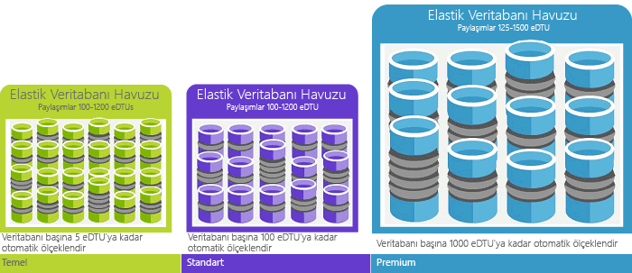

# Veritabanı İşlem Birimlerini (DTU'lar) ve esnek Veritabanı İşlem Birimlerini (eDTU'lar) açıklamaExplaining Database Transaction Units (DTUs) and elastic Database Transaction Units (eDTUs)
Bu makalede, veritabanı işlem birimleri (Dtu'lar) ve esnek veritabanı işlem birimleri (Edtu'lar) ve, isabet ne olur maksimum Dtu veya Edtu'lar hello açıklanmaktadır.This article explains Database Transaction Units (DTUs) and elastic Database Transaction Units (eDTUs) and what happens when you hit hello maximum DTUs or eDTUs.  

## Veritabanı İşlem Birimleri (DTU'lar) nedir?What are Database Transaction Units (DTUs)
Belirli bir performans düzeyinde içinde tek bir Azure SQL veritabanı için bir [hizmet katmanı](sql-database-service-tiers.md#single-database-service-tiers-and-performance-levels), Microsoft Kaynak veritabanı için belirli bir düzeyde (başka bir veritabanında bulunan hello Azure bulut bağımsız) garanti ve sağlayarak bir tahmin edilebilir performans düzeyi.For a single Azure SQL database at a specific performance level within a [service tier](sql-database-service-tiers.md#single-database-service-tiers-and-performance-levels), Microsoft guarantees a certain level of resources for that database (independent of any other database in hello Azure cloud) and providing a predictable level of performance. Bu miktarda kaynak veritabanı işlem birimleri veya Dtu'lar sayısı olarak hesaplanır ve CPU, bellek, g/ç (veri ve işlem günlüğü g/ç) karışık ölçüsüdür.This amount of resources is calculated as a number of Database Transaction Units or DTUs, and is a blended measure of CPU, memory, I/O (data and transaction log I/O). Bu kaynaklar arasında Hello oranı tarafından ilk olarak belirlendi bir [OLTP Kıyaslama iş yükü](sql-database-benchmark-overview.md) toobe gerçek OLTP iş yükü tipik tasarlanmıştır.hello ratio amongst these resources was originally determined by an [OLTP benchmark workload](sql-database-benchmark-overview.md) designed toobe typical of real-world OLTP workloads. İş yükünüzün hello miktarını bu kaynakları aştığında, üretilen iş daraltılmış - yavaş performans ve zaman aşımları sonuç.When your workload exceeds hello amount of any of these resources, your throughput is throttled - resulting in slower performance and timeouts. İş yükünüzün kullandığı hello kaynakları hello kaynakları kullanılabilir tooother SQL veritabanlarında hello Azure bulut etkilemeyen ve diğer iş yükleri tarafından kullanılan hello kaynak hello kaynakları kullanılabilir tooyour SQL veritabanını etkileyen değil.hello resources used by your workload do not impact hello resources available tooother SQL databases in hello Azure cloud, and hello resource used by other workloads do not impact hello resources available tooyour SQL database.

Dtu'lar anlama hello göreli miktarını Azure SQL veritabanları farklı performans düzeyleri ve hizmet katmanları arasında kaynakları için en kullanışlıdır.DTUs are most useful for understanding hello relative amount of resources between Azure SQL Databases at different performance levels and service tiers. Örneğin, bir veritabanı hello performans düzeyini artırarak hello Dtu'lar Katlama toodoubling hello kaynak kullanılabilir toothat veritabanı kümesi karşılık gelir.For example, doubling hello DTUs by increasing hello performance level of a database equates toodoubling hello set of resource available toothat database. Örneğin, 1750 DTU’ya sahip Premium P11 veritabanı 5 DTU’ya sahip Temel veritabanına göre 350 kat daha fazla DTU işlem gücü sağlıyor.For example, a Premium P11 database with 1750 DTUs provides 350x more DTU compute power than a Basic database with 5 DTUs.  

iş yükü, kullanım hello (DTU) kaynak tüketimini daha derin anlayış toogain [Azure SQL veritabanı sorgu performansı öngörüleri](sql-database-query-performance.md) için:toogain deeper insight into hello resource (DTU) consumption of your workload, use [Azure SQL Database Query Performance Insight](sql-database-query-performance.md) to:

- Potansiyel olarak performansı için ayarlanan süre/CPU/yürütme sayısı tarafından Hello en sık kullanılan sorguların tanımlayın.Identify hello top queries by CPU/Duration/Execution count that can potentially be tuned for improved performance. Örneğin, bir g/ç yoğun sorgusu hello kullanımından yararlanabilir [bellek içi iyileştirme tekniklerini](sql-database-in-memory.md) toomake daha iyi kullanımı hello kullanılabilir belleğin düzeyde belirli hizmet katmanını ve performans.For example, an I/O intensive query might benefit from hello use of [in-memory optimization techniques](sql-database-in-memory.md) toomake better use of hello available memory at a certain service tier and performance level.
- Bir sorgu hello ayrıntılarını detaya, metin ve kaynak kullanımı geçmişini görüntüleyin.Drill down into hello details of a query, view its text and history of resource utilization.
- Erişim performans tarafından gerçekleştirilen eylemler Göster önerileri ayarlama [SQL veritabanı Danışmanı'nı](sql-database-advisor.md).Access performance tuning recommendations that show actions performed by [SQL Database Advisor](sql-database-advisor.md).

Yapabilecekleriniz [hizmet katmanları değiştirmek](sql-database-service-tiers.md) (genellikle altında dört saniye ortalaması) en düşük kapalı kalma tooyour uygulamayla herhangi bir zamanda.You can [change service tiers](sql-database-service-tiers.md) at any time with minimal downtime tooyour application (generally averaging under four seconds). Birçok işletme ve uygulama için mümkün toocreate veritabanları olmasına ve özellikle kullanım desenlerini nispeten tahmin edilebilir yeterince ise performans yukarı veya aşağı isteğe bağlı arama.For many businesses and apps, being able toocreate databases and dial performance up or down on demand is enough, especially if usage patterns are relatively predictable. Ancak tahmin edilemeyen kullanım biçimlerine sahipseniz, bunu sabit toomanage maliyetleri ve iş modelinizin yapabilirsiniz.But if you have unpredictable usage patterns, it can make it hard toomanage costs and your business model. Bu senaryoda, belirli bir hello havuzdaki birden fazla veritabanı arasında paylaşılan Edtu sayısı ile bir esnek havuz kullanın.For this scenario, you use an elastic pool with a certain number of eDTUs that are shared among multiple database in hello pool.

## Esnek Veritabanı İşlem Birimleri (eDTU'lar) nedir?What are elastic Database Transaction Units (eDTUs)
Bunun yerine kaynakları (Dtu'lar) tooa her zaman gerekmeyen olup olmadığını bağımsız olarak, kullanılabilir SQL veritabanı ayrılmış bir dizi sağlamak daha veritabanlarına yerleştireceğiniz bir [esnek havuz](sql-database-elastic-pool.md) bir SQL veritabanı sunucusunda kaynak havuzu paylaşır Bu veritabanı arasında.Rather than provide a dedicated set of resources (DTUs) tooa SQL Database that is always available regardless of whether needed not, you can place databases into an [elastic pool](sql-database-elastic-pool.md) on a SQL Database server that shares a pool of resources among those database. Merhaba paylaşılan kaynakları bir esnek havuzdaki esnek veritabanı işlem birimleri veya Edtu ölçülür.hello shared resources in an elastic pool measured by elastic Database Transaction Units or eDTUs. Esnek havuzlar toomanage hello performans hedeflerini birden çok yaygın olarak değişen sahip veritabanları ve tahmin edilemeyen kullanım biçimlerine için basit ve uygun maliyetli bir çözüm sağlar.Elastic pools provide a simple cost effective solution toomanage hello performance goals for multiple databases that have widely varying and unpredictable usage patterns. Bir esnek havuz tek veritabanı hello kaynakların tümünü kullanan garanti edebilir hello havuzda olduğunu ve ayrıca en az miktarda kaynak her zaman kullanılabilir tooa esnek havuzdaki veritabanıdır.In an elastic pool, you can guarantee that no one database uses all of hello resources in hello pool and also that a minimum amount of resources is always available tooa database in an elastic pool. Bkz: [esnek havuzlar](sql-database-elastic-pool.md) daha fazla bilgi için.See  [elastic pools](sql-database-elastic-pool.md) for more information.

Havuza belirli bir fiyat karşılığında, belirli bir sayıda eDTU verilir.A pool is given a set number of eDTUs, for a set price. Merhaba esnek havuz tek veritabanlarını hello esneklik tooauto ölçekli yapılandırılmış hello sınırları içinde verilir.Within hello elastic pool, individual databases are given hello flexibility tooauto-scale within hello configured boundaries. Hafif yükleri altındaki veritabanları daha az veritabanları hiçbir yük altında hiçbir Edtu'lar tüketen toohello noktası yukarı tüketmesine sırada ağır yük altında daha fazla Edtu'lar toomeet isteğe bağlı bir veritabanı kullanabilir.Under heavy load, a database can consume more eDTUs toomeet demand while databases under light loads consume less, up toohello point that databases under no load consume no eDTUs. Merhaba tüm havuz için kaynak sağlama tarafından yerine veritabanı başına yönetim görevleri basitleştirilmiştir ve hello havuzu için tahmin edilebilir bir bütçe vardır.By provisioning resources for hello entire pool, rather than per database, management tasks are simplified and you have a predictable budget for hello pool.

Ek Edtu'lar tooan varolan havuzu hiçbir etkisi olmadan hiçbir veritabanı kapalı kalma süresi ile Merhaba veritabanlarında hello havuzunda eklenebilir.Additional eDTUs can be added tooan existing pool with no database downtime and with no impact on hello databases in hello pool. Benzer şekilde, ek eDTU’lara artık ihtiyaç yoksa bunlar mevcut bir havuzdan ne zaman isterseniz kaldırılabilir.Similarly, if extra eDTUs are no longer needed, they can be removed from an existing pool at any point in time. Eklemek veya veritabanlarını toohello havuzu çıkarmak veya sınırı hello Edtu'lar bir veritabanı miktarını ağır yük tooreserve Edtu'lar altında diğer veritabanları için kullanabilirsiniz.You can add or subtract databases toohello pool, or limit hello amount of eDTUs a database can use under heavy load tooreserve eDTUs for other databases. Bir veritabanı beklendiği altında-kullanılarak durumdaysa kaynakları hello havuzu dışında taşıyın ve tahmin edilebilir miktarda kaynak gerektirdiği tek bir veritabanı olarak yapılandırın.If a database is predictably under-utilizing resources, you can move it out of hello pool and configure it as a single database with predictable amount of resources it requires.

## My iş yükü tarafından gerekli Dtu'lar hello sayısını nasıl belirleyebilirim?How can I determine hello number of DTUs needed by my workload?
Toomigrate mevcut şirket içi veya SQL Server sanal makine iş yükü tooAzure SQL veritabanı arıyorsanız, hello kullanabilirsiniz [DTU Hesaplayıcıyı](http://dtucalculator.azurewebsites.net/) tooapproximate hello gerekli Dtu'lar sayısı.If you are looking toomigrate an existing on-premises or SQL Server virtual machine workload tooAzure SQL Database, you can use hello [DTU Calculator](http://dtucalculator.azurewebsites.net/) tooapproximate hello number of DTUs needed. Bir mevcut Azure SQL veritabanı iş yükü için kullandığınız [SQL veritabanı sorgu performansı öngörüleri](sql-database-query-performance.md) toounderstand, veritabanı kaynak tüketimi (Dtu'lar) tooget daha derin bir anlayış nasıl toooptimize, iş yükü.For an existing Azure SQL Database workload, you can use [SQL Database Query Performance Insight](sql-database-query-performance.md) toounderstand your database resource consumption (DTUs) tooget deeper insight into how toooptimize your workload. Merhaba de kullanabilirsiniz [sys.dm_db_ resource_stats](https://msdn.microsoft.com/library/dn800981.aspx) DMV tooget hello kaynak tüketimi bilgileri hello için son bir saat.You can also use hello [sys.dm_db_ resource_stats](https://msdn.microsoft.com/library/dn800981.aspx) DMV tooget hello resource consumption information for hello last one hour. Alternatif olarak, katalog görünümünü hello [sys.resource_stats](http://msdn.microsoft.com/library/dn269979.aspx) ayrıca olması sorgulanan tooget hello aynı veri hello son 14 gün için bir alt doğruluğu beş dakikalık ortalamalar, ancak en.Alternatively, hello catalog view [sys.resource_stats](http://msdn.microsoft.com/library/dn269979.aspx) can also be queried tooget hello same data for hello last 14 days, although at a lower fidelity of five-minute averages.

## Esnek bir kaynak havuzundan fayda sağlayıp sağlayamayacağımı nasıl öğrenebilirim?How do I know if I could benefit from an elastic pool of resources?
Havuzlar, belirli kullanım düzenlerine sahip çok sayıda veritabanı bulunan durumlar için uygundur.Pools are suited for a large number of databases with specific utilization patterns. Söz konusu kullanım düzeni, belirli bir veritabanı için ortalama düşük düzeyde kullanım ile nispeten nadir zamanlarda kullanımın ani olarak artması şeklindedir.For a given database, this pattern is characterized by low average utilization with relatively infrequent utilization spikes. SQL veritabanı otomatik olarak varolan bir SQL veritabanı sunucusuna veritabanlarında hello geçmiş kaynak kullanımını değerlendirir ve hello Azure portal hello uygun havuzu yapılandırması önerir.SQL Database automatically evaluates hello historical resource usage of databases in an existing SQL Database server and recommends hello appropriate pool configuration in hello Azure portal. Daha fazla bilgi için bkz. [ne zaman elastik bir havuz kullanılması gerekir?](sql-database-elastic-pool.md)For more information, see [when should an elastic pool be used?](sql-database-elastic-pool.md)

## Maksimum DTU sayıma ulaştığımda ne olur?What happens when I hit my maximum DTUs
Performans düzeyleri ayarlandığından ve yönetilen tooprovide hello kaynakları toorun veritabanının yükünüzü toohello max sınırları, seçili hizmet katmanı/performans düzeyini izin yukarı gerekli.Performance levels are calibrated and governed tooprovide hello needed resources toorun your database workload up toohello max limits allowed for your selected service tier/performance level. İş yükünüzün CPU/Data GÇ/günlük GÇ sınırları hello sınırları basarsa, hello izin verilen en yüksek düzeyde tooreceive hello kaynakları devam, ancak sorgularınızı artan büyük olasılıkla toosee gecikmeleri olduğunuz.If your workload is hitting hello limits in one of CPU/Data IO/Log IO limits, you continue tooreceive hello resources at hello maximum allowed level, but you are likely toosee increased latencies for your queries. Merhaba yavaşlama sorguları zamanlama başlar, bu nedenle önemli hale sürece bu sınırları hataları, ancak yerine yavaşlama hello iş yükü içinde neden değil. İzin verilen en yüksek eş zamanlı kullanıcı oturumu/isteği (çalışan iş parçacıkları) sayısı sınırına ulaşırsanız açık hatalar görürsünüz.These limits do not result in any errors, but rather a slowdown in hello workload, unless hello slowdown becomes so severe that queries start timing out. If you are hitting limits of maximum allowed concurrent user sessions/requests (worker threads), you see explicit errors. CPU, bellek, veri G/Ç ve işlem günlüğü G/Ç kaynakları dışındaki kaynaklara yönelik sınırlar hakkında bilgi edinmek için bkz. [Azure SQL Database resource limits](sql-database-resource-limits.md) (Azure SQL Veritabanı kaynak sınırları).See [Azure SQL Database resource limits](sql-database-resource-limits.md) for information on limit on resources other than CPU, memory, data I/O, and transaction log I/O.

## Sonraki adımlarNext steps
* Bkz: [hizmet katmanı](sql-database-service-tiers.md) hello Dtu ve Edtu tek veritabanları ve esnek havuzlar için kullanılabilir hakkında bilgi için.See [Service tier](sql-database-service-tiers.md) for information on hello DTUs and eDTUs available for single databases and for elastic pools.
* CPU, bellek, veri G/Ç ve işlem günlüğü G/Ç kaynakları dışındaki kaynaklara yönelik sınırlar hakkında bilgi edinmek için bkz. [Azure SQL Database resource limits](sql-database-resource-limits.md) (Azure SQL Veritabanı kaynak sınırları).See [Azure SQL Database resource limits](sql-database-resource-limits.md) for information on limit on resources other than CPU, memory, data I/O, and transaction log I/O.
* Bkz: [SQL veritabanı sorgu performansı öngörüleri](sql-database-query-performance.md) toounderstand (Dtu'lar) tüketim.See [SQL Database Query Performance Insight](sql-database-query-performance.md) toounderstand your (DTUs) consumption.
* Bkz: [SQL veritabanı Kıyaslama genel bakış](sql-database-benchmark-overview.md) toounderstand hello Metodoloji hello OLTP Kıyaslama iş yükü arkasında kullanılan DTU blend toodetermine hello.See [SQL Database benchmark overview](sql-database-benchmark-overview.md) toounderstand hello methodology behind hello OLTP benchmark workload used toodetermine hello DTU blend.
