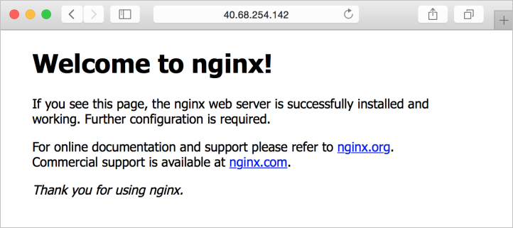

# <a name="how-toouse-packer-toocreate-linux-virtual-machine-images-in-azure"></a><span data-ttu-id="6af24-103">Azure'da nasıl toouse Packer toocreate Linux sanal makine görüntüleri</span><span class="sxs-lookup"><span data-stu-id="6af24-103">How toouse Packer toocreate Linux virtual machine images in Azure</span></span>
<span data-ttu-id="6af24-104">Her sanal makine (VM) azure'da hello Linux dağıtım ve işletim sistemi sürümü tanımlayan bir görüntüden oluşturulur.</span><span class="sxs-lookup"><span data-stu-id="6af24-104">Each virtual machine (VM) in Azure is created from an image that defines hello Linux distribution and OS version.</span></span> <span data-ttu-id="6af24-105">Görüntüleri, önceden yüklenmiş uygulamalar ve yapılandırmalar içerebilir.</span><span class="sxs-lookup"><span data-stu-id="6af24-105">Images can include pre-installed applications and configurations.</span></span> <span data-ttu-id="6af24-106">en yaygın dağıtımları ve uygulama ortamları için birçok ilk ve üçüncü taraf görüntüsü Hello Azure Marketi sağlar veya kendi özel görüntülerinizi uyarlanmış tooyour gereksinimlerini oluşturabilirsiniz.</span><span class="sxs-lookup"><span data-stu-id="6af24-106">hello Azure Marketplace provides many first and third-party images for most common distributions and application environments, or you can create your own custom images tailored tooyour needs.</span></span> <span data-ttu-id="6af24-107">Bu makalede nasıl toouse hello açık kaynak aracı ayrıntıları [Packer](https://www.packer.io/) azure'da toodefine ve yapı özel görüntüler.</span><span class="sxs-lookup"><span data-stu-id="6af24-107">This article details how toouse hello open source tool [Packer](https://www.packer.io/) toodefine and build custom images in Azure.</span></span>


## <a name="create-azure-resource-group"></a><span data-ttu-id="6af24-108">Azure kaynak grubu oluşturun</span><span class="sxs-lookup"><span data-stu-id="6af24-108">Create Azure resource group</span></span>
<span data-ttu-id="6af24-109">Merhaba kaynak VM derlemeler gibi hello oluşturma işlemi sırasında geçici Azure kaynaklarını Packer oluşturur.</span><span class="sxs-lookup"><span data-stu-id="6af24-109">During hello build process, Packer creates temporary Azure resources as it builds hello source VM.</span></span> <span data-ttu-id="6af24-110">bir görüntü olarak kullanmak üzere VM kaynak toocapture, bir kaynak grubu tanımlamanız gerekir.</span><span class="sxs-lookup"><span data-stu-id="6af24-110">toocapture that source VM for use as an image, you must define a resource group.</span></span> <span data-ttu-id="6af24-111">Merhaba hello Packer oluşturma işleminin çıktısı bu kaynak grubunda depolanır.</span><span class="sxs-lookup"><span data-stu-id="6af24-111">hello output from hello Packer build process is stored in this resource group.</span></span>

<span data-ttu-id="6af24-112">[az group create](/cli/azure/group#create) ile bir kaynak grubu oluşturun.</span><span class="sxs-lookup"><span data-stu-id="6af24-112">Create a resource group with [az group create](/cli/azure/group#create).</span></span> <span data-ttu-id="6af24-113">Merhaba aşağıdaki örnekte oluşturur adlı bir kaynak grubu *myResourceGroup* hello içinde *eastus* konumu:</span><span class="sxs-lookup"><span data-stu-id="6af24-113">hello following example creates a resource group named *myResourceGroup* in hello *eastus* location:</span></span>

```azurecli
az group create -n myResourceGroup -l eastus
```


## <a name="create-azure-credentials"></a><span data-ttu-id="6af24-114">Azure kimlik bilgileri oluşturun</span><span class="sxs-lookup"><span data-stu-id="6af24-114">Create Azure credentials</span></span>
<span data-ttu-id="6af24-115">Packer bir hizmet sorumlusu kullanarak Azure ile kimliğini doğrular.</span><span class="sxs-lookup"><span data-stu-id="6af24-115">Packer authenticates with Azure using a service principal.</span></span> <span data-ttu-id="6af24-116">Bir Azure hizmet sorumlusu uygulamaları, hizmetleri ve Packer gibi Otomasyon araçları ile birlikte kullanabileceğiniz bir güvenlik kimliğidir.</span><span class="sxs-lookup"><span data-stu-id="6af24-116">An Azure service principal is a security identity that you can use with apps, services, and automation tools like Packer.</span></span> <span data-ttu-id="6af24-117">Denetim ve toowhat işlemleri hello hizmet sorumlusu Azure'da gerçekleştirebilirsiniz gibi hello izinleri tanımlayın.</span><span class="sxs-lookup"><span data-stu-id="6af24-117">You control and define hello permissions as toowhat operations hello service principal can perform in Azure.</span></span>

<span data-ttu-id="6af24-118">Bir hizmet sorumlusu ile oluşturma [az ad sp oluşturma-için-rbac](/cli/azure/ad/sp#create-for-rbac) ve Packer gereken çıktı hello kimlik bilgileri:</span><span class="sxs-lookup"><span data-stu-id="6af24-118">Create a service principal with [az ad sp create-for-rbac](/cli/azure/ad/sp#create-for-rbac) and output hello credentials that Packer needs:</span></span>

```azurecli
az ad sp create-for-rbac --query [appId,password,tenant]
```

<span data-ttu-id="6af24-119">Komutları önceki hello hello çıktının bir örnek aşağıdaki gibidir:</span><span class="sxs-lookup"><span data-stu-id="6af24-119">An example of hello output from hello preceding commands is as follows:</span></span>

```azurecli
"f5b6a5cf-fbdf-4a9f-b3b8-3c2cd00225a4",
"0e760437-bf34-4aad-9f8d-870be799c55d",
"72f988bf-86f1-41af-91ab-2d7cd011db47"
```

<span data-ttu-id="6af24-120">tooauthenticate tooAzure etmeniz, Azure aboneliğinizin kimliği ile tooobtain [az hesabı Göster](/cli/azure/account#show):</span><span class="sxs-lookup"><span data-stu-id="6af24-120">tooauthenticate tooAzure, you also need tooobtain your Azure subscription ID with [az account show](/cli/azure/account#show):</span></span>

```azurecli
az account show --query [id] --output tsv
```

<span data-ttu-id="6af24-121">Bu iki komutlarının hello çıktısını hello sonraki adımda kullanın.</span><span class="sxs-lookup"><span data-stu-id="6af24-121">You use hello output from these two commands in hello next step.</span></span>


## <a name="define-packer-template"></a><span data-ttu-id="6af24-122">Packer şablon oluştur</span><span class="sxs-lookup"><span data-stu-id="6af24-122">Define Packer template</span></span>
<span data-ttu-id="6af24-123">toobuild görüntüleri bir JSON dosyası olarak bir şablon oluşturun.</span><span class="sxs-lookup"><span data-stu-id="6af24-123">toobuild images, you create a template as a JSON file.</span></span> <span data-ttu-id="6af24-124">Merhaba şablonunda hello gerçek taşımak provisioners derleme işlemi ve oluşturucular tanımlayın.</span><span class="sxs-lookup"><span data-stu-id="6af24-124">In hello template, you define builders and provisioners that carry out hello actual build process.</span></span> <span data-ttu-id="6af24-125">Packer sahip bir [Azure sağlayıcısı](https://www.packer.io/docs/builders/azure.html) toodefine Azure sağlayan adım önceki hello oluşturulan hello hizmet asıl kimlik bilgileri gibi kaynaklar.</span><span class="sxs-lookup"><span data-stu-id="6af24-125">Packer has a [provisioner for Azure](https://www.packer.io/docs/builders/azure.html) that allows you toodefine Azure resources, such as hello service principal credentials created in hello preceding step.</span></span>

<span data-ttu-id="6af24-126">Adlı bir dosya oluşturun *ubuntu.json* ve Yapıştır hello aşağıdaki içeriği.</span><span class="sxs-lookup"><span data-stu-id="6af24-126">Create a file named *ubuntu.json* and paste hello following content.</span></span> <span data-ttu-id="6af24-127">Kendi değerlerinizi için hello aşağıdakileri girin:</span><span class="sxs-lookup"><span data-stu-id="6af24-127">Enter your own values for hello following:</span></span>

| <span data-ttu-id="6af24-128">Parametre</span><span class="sxs-lookup"><span data-stu-id="6af24-128">Parameter</span></span>                           | <span data-ttu-id="6af24-129">Burada tooobtain</span><span class="sxs-lookup"><span data-stu-id="6af24-129">Where tooobtain</span></span> |
|-------------------------------------|----------------------------------------------------|
| <span data-ttu-id="6af24-130">*client_id*</span><span class="sxs-lookup"><span data-stu-id="6af24-130">*client_id*</span></span>                         | <span data-ttu-id="6af24-131">İlk satırı çıktısı `az ad sp` Oluştur komutu - *AppID*</span><span class="sxs-lookup"><span data-stu-id="6af24-131">First line of output from `az ad sp` create command - *appId*</span></span> |
| <span data-ttu-id="6af24-132">*client_secret*</span><span class="sxs-lookup"><span data-stu-id="6af24-132">*client_secret*</span></span>                     | <span data-ttu-id="6af24-133">İkinci satır çıktısı `az ad sp` Oluştur komutu - *parola*</span><span class="sxs-lookup"><span data-stu-id="6af24-133">Second line of output from `az ad sp` create command - *password*</span></span> |
| <span data-ttu-id="6af24-134">*tenant_id*</span><span class="sxs-lookup"><span data-stu-id="6af24-134">*tenant_id*</span></span>                         | <span data-ttu-id="6af24-135">Üçüncü satır çıktısı `az ad sp` Oluştur komutu - *Kiracı*</span><span class="sxs-lookup"><span data-stu-id="6af24-135">Third line of output from `az ad sp` create command - *tenant*</span></span> |
| <span data-ttu-id="6af24-136">*ABONELİK_KİMLİĞİ*</span><span class="sxs-lookup"><span data-stu-id="6af24-136">*subscription_id*</span></span>                   | <span data-ttu-id="6af24-137">Çıktı `az account show` komutu</span><span class="sxs-lookup"><span data-stu-id="6af24-137">Output from `az account show` command</span></span> |
| <span data-ttu-id="6af24-138">*managed_image_resource_group_name*</span><span class="sxs-lookup"><span data-stu-id="6af24-138">*managed_image_resource_group_name*</span></span> | <span data-ttu-id="6af24-139">Merhaba ilk adımda oluşturduğunuz kaynak grubunun adı</span><span class="sxs-lookup"><span data-stu-id="6af24-139">Name of resource group you created in hello first step</span></span> |
| <span data-ttu-id="6af24-140">*managed_image_name*</span><span class="sxs-lookup"><span data-stu-id="6af24-140">*managed_image_name*</span></span>                | <span data-ttu-id="6af24-141">Oluşturulan hello yönetilen disk görüntüsü için adı</span><span class="sxs-lookup"><span data-stu-id="6af24-141">Name for hello managed disk image that is created</span></span> |


```json
{
  "builders": [{
    "type": "azure-arm",

    "client_id": "f5b6a5cf-fbdf-4a9f-b3b8-3c2cd00225a4",
    "client_secret": "0e760437-bf34-4aad-9f8d-870be799c55d",
    "tenant_id": "72f988bf-86f1-41af-91ab-2d7cd011db47",
    "subscription_id": "xxxxxxxx-xxxx-xxxx-xxxx-xxxxxxxxxxx",

    "managed_image_resource_group_name": "myResourceGroup",
    "managed_image_name": "myPackerImage",

    "os_type": "Linux",
    "image_publisher": "Canonical",
    "image_offer": "UbuntuServer",
    "image_sku": "16.04-LTS",

    "azure_tags": {
        "dept": "Engineering",
        "task": "Image deployment"
    },

    "location": "East US",
    "vm_size": "Standard_DS2_v2"
  }],
  "provisioners": [{
    "execute_command": "chmod +x {{ .Path }}; {{ .Vars }} sudo -E sh '{{ .Path }}'",
    "inline": [
      "apt-get update",
      "apt-get upgrade -y",
      "apt-get -y install nginx",

      "/usr/sbin/waagent -force -deprovision+user && export HISTSIZE=0 && sync"
    ],
    "inline_shebang": "/bin/sh -x",
    "type": "shell"
  }]
}
```

<span data-ttu-id="6af24-142">Bu şablon bir Ubuntu 16.04 LTS görüntü oluşturur, NGINX yükler ve sonra hello VM deprovisions.</span><span class="sxs-lookup"><span data-stu-id="6af24-142">This template builds an Ubuntu 16.04 LTS image, installs NGINX, then deprovisions hello VM.</span></span>

> [!NOTE]
> <span data-ttu-id="6af24-143">Bu şablon tooprovision kullanıcı kimlik bilgilerini genişletirseniz, Ayarla deprovisions Azure Aracısı tooread hello hello sağlayıcısı komutu `-deprovision` yerine `deprovision+user`.</span><span class="sxs-lookup"><span data-stu-id="6af24-143">If you expand on this template tooprovision user credentials, adjust hello provisioner command that deprovisions hello Azure agent tooread `-deprovision` rather than `deprovision+user`.</span></span>
> <span data-ttu-id="6af24-144">Merhaba `+user` bayrağını hello kaynak VM tüm kullanıcı hesaplarını kaldırır.</span><span class="sxs-lookup"><span data-stu-id="6af24-144">hello `+user` flag removes all user accounts from hello source VM.</span></span>


## <a name="build-packer-image"></a><span data-ttu-id="6af24-145">Packer yansıması oluştur</span><span class="sxs-lookup"><span data-stu-id="6af24-145">Build Packer image</span></span>
<span data-ttu-id="6af24-146">Yerel makinenizde yüklü Packer zaten yoksa [hello Packer yükleme yönergelerini izleyin](https://www.packer.io/docs/install/index.html).</span><span class="sxs-lookup"><span data-stu-id="6af24-146">If you don't already have Packer installed on your local machine, [follow hello Packer installation instructions](https://www.packer.io/docs/install/index.html).</span></span>

<span data-ttu-id="6af24-147">Merhaba görüntüsünü, Packer belirterek şablon dosyasını aşağıdaki gibi oluşturabilirsiniz:</span><span class="sxs-lookup"><span data-stu-id="6af24-147">Build hello image by specifying your Packer template file as follows:</span></span>

```bash
./packer build ubuntu.json
```

<span data-ttu-id="6af24-148">Komutları önceki hello hello çıktının bir örnek aşağıdaki gibidir:</span><span class="sxs-lookup"><span data-stu-id="6af24-148">An example of hello output from hello preceding commands is as follows:</span></span>

```bash
azure-arm output will be in this color.

==> azure-arm: Running builder ...
    azure-arm: Creating Azure Resource Manager (ARM) client ...
==> azure-arm: Creating resource group ...
==> azure-arm:  -> ResourceGroupName : ‘packer-Resource-Group-swtxmqm7ly’
==> azure-arm:  -> Location          : ‘East US’
==> azure-arm:  -> Tags              :
==> azure-arm:  ->> dept : Engineering
==> azure-arm:  ->> task : Image deployment
==> azure-arm: Validating deployment template ...
==> azure-arm:  -> ResourceGroupName : ‘packer-Resource-Group-swtxmqm7ly’
==> azure-arm:  -> DeploymentName    : ‘pkrdpswtxmqm7ly’
==> azure-arm: Deploying deployment template ...
==> azure-arm:  -> ResourceGroupName : ‘packer-Resource-Group-swtxmqm7ly’
==> azure-arm:  -> DeploymentName    : ‘pkrdpswtxmqm7ly’
==> azure-arm: Getting hello VM’s IP address ...
==> azure-arm:  -> ResourceGroupName   : ‘packer-Resource-Group-swtxmqm7ly’
==> azure-arm:  -> PublicIPAddressName : ‘packerPublicIP’
==> azure-arm:  -> NicName             : ‘packerNic’
==> azure-arm:  -> Network Connection  : ‘PublicEndpoint’
==> azure-arm:  -> IP Address          : ‘40.76.218.147’
==> azure-arm: Waiting for SSH toobecome available...
==> azure-arm: Connected tooSSH!
==> azure-arm: Provisioning with shell script: /var/folders/h1/ymh5bdx15wgdn5hvgj1wc0zh0000gn/T/packer-shell868574263
    azure-arm: WARNING! hello waagent service will be stopped.
    azure-arm: WARNING! Cached DHCP leases will be deleted.
    azure-arm: WARNING! root password will be disabled. You will not be able toologin as root.
    azure-arm: WARNING! /etc/resolvconf/resolv.conf.d/tail and /etc/resolvconf/resolv.conf.d/original will be deleted.
    azure-arm: WARNING! packer account and entire home directory will be deleted.
==> azure-arm: Querying hello machine’s properties ...
==> azure-arm:  -> ResourceGroupName : ‘packer-Resource-Group-swtxmqm7ly’
==> azure-arm:  -> ComputeName       : ‘pkrvmswtxmqm7ly’
==> azure-arm:  -> Managed OS Disk   : ‘/subscriptions/guid/resourceGroups/packer-Resource-Group-swtxmqm7ly/providers/Microsoft.Compute/disks/osdisk’
==> azure-arm: Powering off machine ...
==> azure-arm:  -> ResourceGroupName : ‘packer-Resource-Group-swtxmqm7ly’
==> azure-arm:  -> ComputeName       : ‘pkrvmswtxmqm7ly’
==> azure-arm: Capturing image ...
==> azure-arm:  -> Compute ResourceGroupName : ‘packer-Resource-Group-swtxmqm7ly’
==> azure-arm:  -> Compute Name              : ‘pkrvmswtxmqm7ly’
==> azure-arm:  -> Compute Location          : ‘East US’
==> azure-arm:  -> Image ResourceGroupName   : ‘myResourceGroup’
==> azure-arm:  -> Image Name                : ‘myPackerImage’
==> azure-arm:  -> Image Location            : ‘eastus’
==> azure-arm: Deleting resource group ...
==> azure-arm:  -> ResourceGroupName : ‘packer-Resource-Group-swtxmqm7ly’
==> azure-arm: Deleting hello temporary OS disk ...
==> azure-arm:  -> OS Disk : skipping, managed disk was used...
Build ‘azure-arm’ finished.

==> Builds finished. hello artifacts of successful builds are:
--> azure-arm: Azure.ResourceManagement.VMImage:

ManagedImageResourceGroupName: myResourceGroup
ManagedImageName: myPackerImage
ManagedImageLocation: eastus
```


## <a name="create-vm-from-azure-image"></a><span data-ttu-id="6af24-149">Azure görüntüden VM oluşturma</span><span class="sxs-lookup"><span data-stu-id="6af24-149">Create VM from Azure Image</span></span>
<span data-ttu-id="6af24-150">Artık bir VM ile görüntüden oluşturabilirsiniz [az vm oluşturma](/cli/azure/vm#create).</span><span class="sxs-lookup"><span data-stu-id="6af24-150">You can now create a VM from your Image with [az vm create](/cli/azure/vm#create).</span></span> <span data-ttu-id="6af24-151">Merhaba hello ile oluşturulan görüntüsü belirtin `--image` parametresi.</span><span class="sxs-lookup"><span data-stu-id="6af24-151">Specify hello Image you created with hello `--image` parameter.</span></span> <span data-ttu-id="6af24-152">Merhaba aşağıdaki örnekte oluşturur adlı bir VM'den *myVM* gelen *myPackerImage* ve zaten mevcut değilse SSH anahtarları oluşturur:</span><span class="sxs-lookup"><span data-stu-id="6af24-152">hello following example creates a VM named *myVM* from *myPackerImage* and generates SSH keys if they do not already exist:</span></span>

```azurecli
az vm create \
    --resource-group myResourceGroup \
    --name myVM \
    --image myPackerImage \
    --admin-username azureuser \
    --generate-ssh-keys
```

<span data-ttu-id="6af24-153">Birkaç dakika toocreate hello VM alır.</span><span class="sxs-lookup"><span data-stu-id="6af24-153">It takes a few minutes toocreate hello VM.</span></span> <span data-ttu-id="6af24-154">Merhaba VM oluşturulduktan sonra hello not edin `publicIpAddress` hello Azure CLI tarafından görüntülenir.</span><span class="sxs-lookup"><span data-stu-id="6af24-154">Once hello VM has been created, take note of hello `publicIpAddress` displayed by hello Azure CLI.</span></span> <span data-ttu-id="6af24-155">Bu adres kullanılan tooaccess hello NGINX bir web tarayıcısı aracılığıyla sitedir.</span><span class="sxs-lookup"><span data-stu-id="6af24-155">This address is used tooaccess hello NGINX site via a web browser.</span></span>

<span data-ttu-id="6af24-156">açık bağlantı noktası 80 hello Internet gelen ile VM'nizi tooallow web trafiği tooreach [az vm Aç-port](/cli/azure/vm#open-port):</span><span class="sxs-lookup"><span data-stu-id="6af24-156">tooallow web traffic tooreach your VM, open port 80 from hello Internet with [az vm open-port](/cli/azure/vm#open-port):</span></span>

```azurecli
az vm open-port \
    --resource-group myResourceGroup \
    --name myVM \
    --port 80
```

## <a name="test-vm-and-nginx"></a><span data-ttu-id="6af24-157">Test VM ve NGINX</span><span class="sxs-lookup"><span data-stu-id="6af24-157">Test VM and NGINX</span></span>
<span data-ttu-id="6af24-158">Bir web tarayıcısı açın ve girin artık `http://publicIpAddress` hello adres çubuğundaki.</span><span class="sxs-lookup"><span data-stu-id="6af24-158">Now you can open a web browser and enter `http://publicIpAddress` in hello address bar.</span></span> <span data-ttu-id="6af24-159">Kendi ortak sağlamak hello VM IP adresinden oluşturma işlemi.</span><span class="sxs-lookup"><span data-stu-id="6af24-159">Provide your own public IP address from hello VM create process.</span></span> <span data-ttu-id="6af24-160">Merhaba varsayılan NGINX sayfası aşağıdaki örneğine hello olduğu gibi görüntülenir:</span><span class="sxs-lookup"><span data-stu-id="6af24-160">hello default NGINX page is displayed as in hello following example:</span></span>

 


## <a name="next-steps"></a><span data-ttu-id="6af24-162">Sonraki adımlar</span><span class="sxs-lookup"><span data-stu-id="6af24-162">Next steps</span></span>
<span data-ttu-id="6af24-163">Bu örnekte, Packer toocreate bir VM görüntüsü zaten yüklü NGINX ile kullanılır.</span><span class="sxs-lookup"><span data-stu-id="6af24-163">In this example, you used Packer toocreate a VM image with NGINX already installed.</span></span> <span data-ttu-id="6af24-164">Var olan dağıtım iş akışları, uygulama tooVMs hello Ansible, Chef veya Puppet görüntüsüyle oluşturulan toodeploy gibi yanı sıra bu VM görüntüsü kullanabilirsiniz.</span><span class="sxs-lookup"><span data-stu-id="6af24-164">You can use this VM image alongside existing deployment workflows, such as toodeploy your app tooVMs created from hello Image with Ansible, Chef, or Puppet.</span></span>

<span data-ttu-id="6af24-165">Diğer Linux distro'lar için ek örnek Packer şablonları için bkz: [bu GitHub deposuna](https://github.com/hashicorp/packer/tree/master/examples/azure).</span><span class="sxs-lookup"><span data-stu-id="6af24-165">For additional example Packer templates for other Linux distros, see [this GitHub repo](https://github.com/hashicorp/packer/tree/master/examples/azure).</span></span>