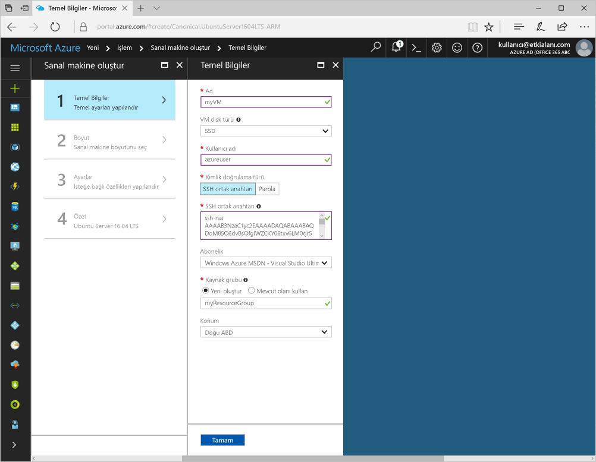
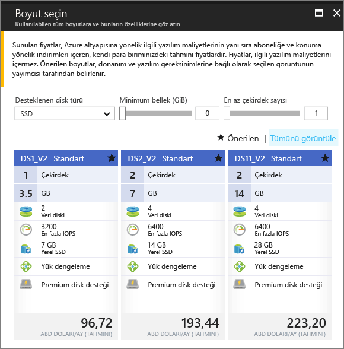

# <a name="create-a-linux-virtual-machine-with-hello-azure-portal"></a><span data-ttu-id="94f38-103">Hello Azure portal ile Linux sanal makine oluşturma</span><span class="sxs-lookup"><span data-stu-id="94f38-103">Create a Linux virtual machine with hello Azure portal</span></span>

<span data-ttu-id="94f38-104">Azure sanal makineleri hello Azure portal oluşturulabilir.</span><span class="sxs-lookup"><span data-stu-id="94f38-104">Azure virtual machines can be created through hello Azure portal.</span></span> <span data-ttu-id="94f38-105">Bu yöntem, sanal makineleri ve tüm ilgili kaynakları oluşturup yapılandırmaya yönelik tarayıcı tabanlı bir kullanıcı arabirimi sağlar.</span><span class="sxs-lookup"><span data-stu-id="94f38-105">This method provides a browser-based user interface for creating and configuring virtual machines and all related resources.</span></span> <span data-ttu-id="94f38-106">Bir sanal makine oluşturma ve hello VM üzerinde bir Web sunucusu yükleme ile bu hızlı başlangıç adımları.</span><span class="sxs-lookup"><span data-stu-id="94f38-106">This Quickstart steps through creating a virtual machine and installing a webserver on hello VM.</span></span>

<span data-ttu-id="94f38-107">Azure aboneliğiniz yoksa başlamadan önce [ücretsiz bir hesap](https://azure.microsoft.com/free/?WT.mc_id=A261C142F) oluşturun.</span><span class="sxs-lookup"><span data-stu-id="94f38-107">If you don't have an Azure subscription, create a [free account](https://azure.microsoft.com/free/?WT.mc_id=A261C142F) before you begin.</span></span>

## <a name="create-ssh-key-pair"></a><span data-ttu-id="94f38-108">SSH anahtar çifti oluşturma</span><span class="sxs-lookup"><span data-stu-id="94f38-108">Create SSH key pair</span></span>

<span data-ttu-id="94f38-109">Bu hızlı başlangıç bir SSH anahtar çifti toocomplete gerekir.</span><span class="sxs-lookup"><span data-stu-id="94f38-109">You need an SSH key pair toocomplete this quick start.</span></span> <span data-ttu-id="94f38-110">Bir SSH anahtar çiftiniz varsa bu adımı atlayabilirsiniz.</span><span class="sxs-lookup"><span data-stu-id="94f38-110">If you have an existing SSH key pair, this step can be skipped.</span></span>

<span data-ttu-id="94f38-111">Bir Bash kabuğunda bu komutu çalıştırın ve hello ekrandaki yönergeleri izleyin.</span><span class="sxs-lookup"><span data-stu-id="94f38-111">From a Bash shell, run this command and follow hello on-screen directions.</span></span> <span data-ttu-id="94f38-112">Merhaba komutu çıktısı hello hello genel anahtar dosyasının dosya adını içerir.</span><span class="sxs-lookup"><span data-stu-id="94f38-112">hello command output includes hello file name of hello public key file.</span></span> <span data-ttu-id="94f38-113">Merhaba ortak anahtar dosyası toohello Pano Hello içeriğini kopyalayın.</span><span class="sxs-lookup"><span data-stu-id="94f38-113">Copy hello contents of hello public key file toohello clipboard.</span></span>

```bash
ssh-keygen -t rsa -b 2048
```

## <a name="log-in-tooazure"></a><span data-ttu-id="94f38-114">İçinde tooAzure oturum</span><span class="sxs-lookup"><span data-stu-id="94f38-114">Log in tooAzure</span></span> 

<span data-ttu-id="94f38-115">İçinde toohello http://portal.azure.com Azure portalında oturum açın.</span><span class="sxs-lookup"><span data-stu-id="94f38-115">Log in toohello Azure portal at http://portal.azure.com.</span></span>

## <a name="create-virtual-machine"></a><span data-ttu-id="94f38-116">Sanal makine oluşturma</span><span class="sxs-lookup"><span data-stu-id="94f38-116">Create virtual machine</span></span>

1. <span data-ttu-id="94f38-117">Merhaba tıklatın **yeni** düğmesi hello sol üst köşesinin hello Azure portalı üzerinde bulunamadı.</span><span class="sxs-lookup"><span data-stu-id="94f38-117">Click hello **New** button found on hello upper left-hand corner of hello Azure portal.</span></span>

2. <span data-ttu-id="94f38-118">**İşlem**'i ve ardından **Ubuntu Server 16.04 LTS**'yi seçin.</span><span class="sxs-lookup"><span data-stu-id="94f38-118">Select **Compute**, and then select **Ubuntu Server 16.04 LTS**.</span></span> 

3. <span data-ttu-id="94f38-119">Merhaba sanal makine bilgilerini girin.</span><span class="sxs-lookup"><span data-stu-id="94f38-119">Enter hello virtual machine information.</span></span> <span data-ttu-id="94f38-120">**Kimlik doğrulama türü** için **SSH ortak anahtarı**’nı seçin.</span><span class="sxs-lookup"><span data-stu-id="94f38-120">For **Authentication type**, select **SSH public key**.</span></span> <span data-ttu-id="94f38-121">SSH ortak anahtarınızı yapıştırılırken tooremove herhangi başında veya sonunda boşluk dikkatli olun.</span><span class="sxs-lookup"><span data-stu-id="94f38-121">When pasting in your SSH public key, take care tooremove any leading or trailing white space.</span></span> <span data-ttu-id="94f38-122">İşlem tamamlandığında **Tamam**’a tıklayın.</span><span class="sxs-lookup"><span data-stu-id="94f38-122">When complete, click **OK**.</span></span>

    

4. <span data-ttu-id="94f38-124">Merhaba VM boyutunu seçin.</span><span class="sxs-lookup"><span data-stu-id="94f38-124">Select a size for hello VM.</span></span> <span data-ttu-id="94f38-125">Daha fazla boyutları toosee seçin **tüm görüntüle** veya hello değiştirme **desteklenen disk türü** Filtresi.</span><span class="sxs-lookup"><span data-stu-id="94f38-125">toosee more sizes, select **View all** or change hello **Supported disk type** filter.</span></span> 

      

5. <span data-ttu-id="94f38-127">Hello ayarları dikey penceresinde hello Varsayılanları tutun ve **Tamam**.</span><span class="sxs-lookup"><span data-stu-id="94f38-127">On hello settings blade, keep hello defaults and click **OK**.</span></span>

6. <span data-ttu-id="94f38-128">Merhaba Özet sayfasında, tıklatın **Tamam** toostart hello sanal makine dağıtımı.</span><span class="sxs-lookup"><span data-stu-id="94f38-128">On hello summary page, click **Ok** toostart hello virtual machine deployment.</span></span>

7. <span data-ttu-id="94f38-129">Merhaba VM sabitlenmiş toohello Azure portalı panosunun olacaktır.</span><span class="sxs-lookup"><span data-stu-id="94f38-129">hello VM will be pinned toohello Azure portal dashboard.</span></span> <span data-ttu-id="94f38-130">Merhaba dağıtım tamamlandıktan sonra otomatik olarak hello VM Özet dikey pencere açılır.</span><span class="sxs-lookup"><span data-stu-id="94f38-130">Once hello deployment has completed, hello VM summary blade automatically opens.</span></span>


## <a name="connect-toovirtual-machine"></a><span data-ttu-id="94f38-131">Toovirtual makineyi bağlayın</span><span class="sxs-lookup"><span data-stu-id="94f38-131">Connect toovirtual machine</span></span>

<span data-ttu-id="94f38-132">Bir SSH bağlantısı ile Merhaba sanal makine oluşturun.</span><span class="sxs-lookup"><span data-stu-id="94f38-132">Create an SSH connection with hello virtual machine.</span></span>

1. <span data-ttu-id="94f38-133">Merhaba tıklatın **Bağlan** hello sanal makine dikey düğmesi.</span><span class="sxs-lookup"><span data-stu-id="94f38-133">Click hello **Connect** button on hello virtual machine blade.</span></span> <span data-ttu-id="94f38-134">Merhaba, kullanılan tooconnect toohello sanal makineye bağlanabilir bir SSH bağlantı dizesi düğmesi görüntüler bağlayın.</span><span class="sxs-lookup"><span data-stu-id="94f38-134">hello connect button displays an SSH connection string that can be used tooconnect toohello virtual machine.</span></span>

     

2. <span data-ttu-id="94f38-136">Çalışma hello aşağıdaki toocreate SSH oturumu bir komutu.</span><span class="sxs-lookup"><span data-stu-id="94f38-136">Run hello following command toocreate an SSH session.</span></span> <span data-ttu-id="94f38-137">Bir hello Azure portal ' kopyaladığınız hello Hello bağlantı dizesini değiştirin.</span><span class="sxs-lookup"><span data-stu-id="94f38-137">Replace hello connection string with hello one you copied from hello Azure portal.</span></span>

```bash 
ssh azureuser@40.112.21.50
```

## <a name="install-nginx"></a><span data-ttu-id="94f38-138">NGINX yükleme</span><span class="sxs-lookup"><span data-stu-id="94f38-138">Install NGINX</span></span>

<span data-ttu-id="94f38-139">Kullanım hello aşağıdaki komut dosyası tooupdate paket kaynaklarını bash ve hello son NGINX paketini yükleyin.</span><span class="sxs-lookup"><span data-stu-id="94f38-139">Use hello following bash script tooupdate package sources and install hello latest NGINX package.</span></span> 

```bash 
#!/bin/bash

# update package source
sudo apt-get -y update

# install NGINX
sudo apt-get -y install nginx
```

<span data-ttu-id="94f38-140">İşiniz bittiğinde, hello SSH oturumu çıkmak ve hello VM Özellikleri'hello Azure portal döndürür.</span><span class="sxs-lookup"><span data-stu-id="94f38-140">When done, exit hello SSH session and return hello VM properties in hello Azure portal.</span></span>


## <a name="open-port-80-for-web-traffic"></a><span data-ttu-id="94f38-141">Web trafiği için 80 numaralı bağlantı noktasını açın</span><span class="sxs-lookup"><span data-stu-id="94f38-141">Open port 80 for web traffic</span></span> 

<span data-ttu-id="94f38-142">Ağ güvenlik grubu (NSG), gelen ve giden trafiğin güvenliğini sağlar.</span><span class="sxs-lookup"><span data-stu-id="94f38-142">A Network security group (NSG) secures inbound and outbound traffic.</span></span> <span data-ttu-id="94f38-143">Azure portal hello VM oluşturulduğunda, bir gelen kuralı SSH bağlantıları için bağlantı noktası 22 oluşturulur.</span><span class="sxs-lookup"><span data-stu-id="94f38-143">When a VM is created from hello Azure portal, an inbound rule is created on port 22 for SSH connections.</span></span> <span data-ttu-id="94f38-144">Bu VM barındıran bir Web sunucusu olduğundan, bir NSG kuralı bağlantı noktası 80 için oluşturulan toobe gerekir.</span><span class="sxs-lookup"><span data-stu-id="94f38-144">Because this VM hosts a webserver, an NSG rule needs toobe created for port 80.</span></span>

1. <span data-ttu-id="94f38-145">Merhaba hello adına Hello sanal makineye tıklayın **kaynak grubu**.</span><span class="sxs-lookup"><span data-stu-id="94f38-145">On hello virtual machine, click hello name of hello **Resource group**.</span></span>
2. <span data-ttu-id="94f38-146">Select hello **ağ güvenlik grubu**.</span><span class="sxs-lookup"><span data-stu-id="94f38-146">Select hello **network security group**.</span></span> <span data-ttu-id="94f38-147">Merhaba NSG hello kullanılarak tanımlanabilir **türü** sütun.</span><span class="sxs-lookup"><span data-stu-id="94f38-147">hello NSG can be identified using hello **Type** column.</span></span> 
3. <span data-ttu-id="94f38-148">Ayarlar altında hello sol menüsünde tıklatın **gelen güvenlik kuralları**.</span><span class="sxs-lookup"><span data-stu-id="94f38-148">On hello left-hand menu, under settings, click **Inbound security rules**.</span></span>
4. <span data-ttu-id="94f38-149">**Ekle**'ye tıklayın.</span><span class="sxs-lookup"><span data-stu-id="94f38-149">Click on **Add**.</span></span>
5. <span data-ttu-id="94f38-150">**Ad** alanına **http** yazın.</span><span class="sxs-lookup"><span data-stu-id="94f38-150">In **Name**, type **http**.</span></span> <span data-ttu-id="94f38-151">Emin olun **bağlantı noktası aralığı** too80 ayarlanır ve **eylem** çok ayarlanır**izin**.</span><span class="sxs-lookup"><span data-stu-id="94f38-151">Make sure **Port range** is set too80 and **Action** is set too**Allow**.</span></span> 
6. <span data-ttu-id="94f38-152">**Tamam** düğmesine tıklayın.</span><span class="sxs-lookup"><span data-stu-id="94f38-152">Click **OK**.</span></span>


## <a name="view-hello-nginx-welcome-page"></a><span data-ttu-id="94f38-153">Merhaba NGINX Karşılama sayfasını görüntüle</span><span class="sxs-lookup"><span data-stu-id="94f38-153">View hello NGINX welcome page</span></span>

<span data-ttu-id="94f38-154">NGINX ile tooyour VM yüklü ve bağlantı noktası 80'i açın, hello Web sunucusu artık erişilebilir hello Internet.</span><span class="sxs-lookup"><span data-stu-id="94f38-154">With NGINX installed, and port 80 open tooyour VM, hello webserver can now be accessed from hello internet.</span></span> <span data-ttu-id="94f38-155">Bir web tarayıcısı açın ve hello VM hello ortak IP adresini girin.</span><span class="sxs-lookup"><span data-stu-id="94f38-155">Open a web browser, and enter hello public IP address of hello VM.</span></span> <span data-ttu-id="94f38-156">Merhaba genel IP adresi hello VM dikey penceresinde hello Azure portalında bulunabilir.</span><span class="sxs-lookup"><span data-stu-id="94f38-156">hello public IP address can be found on hello VM blade in hello Azure portal.</span></span>

 

## <a name="clean-up-resources"></a><span data-ttu-id="94f38-158">Kaynakları temizleme</span><span class="sxs-lookup"><span data-stu-id="94f38-158">Clean up resources</span></span>

<span data-ttu-id="94f38-159">Artık gerektiğinde Merhaba kaynak grubu, sanal makine ve tüm ilişkili kaynakları silin.</span><span class="sxs-lookup"><span data-stu-id="94f38-159">When no longer needed, delete hello resource group, virtual machine, and all related resources.</span></span> <span data-ttu-id="94f38-160">toodo bunu hello sanal makine dikey penceresinden hello kaynak grubu seçin ve tıklatın **silmek**.</span><span class="sxs-lookup"><span data-stu-id="94f38-160">toodo so, select hello resource group from hello virtual machine blade and click **Delete**.</span></span>

## <a name="next-steps"></a><span data-ttu-id="94f38-161">Sonraki adımlar</span><span class="sxs-lookup"><span data-stu-id="94f38-161">Next steps</span></span>

<span data-ttu-id="94f38-162">Bu hızlı başlangıçta basit bir sanal makine ve bir ağ güvenlik grubu kuralı dağıtıp, bir web sunucusu yüklediniz.</span><span class="sxs-lookup"><span data-stu-id="94f38-162">In this quick start, you’ve deployed a simple virtual machine, a network security group rule, and installed a web server.</span></span> <span data-ttu-id="94f38-163">Azure sanal makinelerde hakkında daha fazla toolearn toohello öğretici Linux VM'ler için devam edin.</span><span class="sxs-lookup"><span data-stu-id="94f38-163">toolearn more about Azure virtual machines, continue toohello tutorial for Linux VMs.</span></span>

> [!div class="nextstepaction"]
> [<span data-ttu-id="94f38-164">Azure Linux sanal makine öğreticileri</span><span class="sxs-lookup"><span data-stu-id="94f38-164">Azure Linux virtual machine tutorials</span></span>](./tutorial-manage-vm.md)
