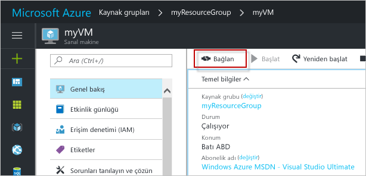

# <a name="create-a-linux-virtual-machine-with-hello-azure-portal"></a>Hello Azure portal ile Linux sanal makine oluşturma

Azure sanal makineleri hello Azure portal oluşturulabilir. Bu yöntem, sanal makineleri ve tüm ilgili kaynakları oluşturup yapılandırmaya yönelik tarayıcı tabanlı bir kullanıcı arabirimi sağlar. Bir sanal makine oluşturma ve hello VM üzerinde bir Web sunucusu yükleme ile bu hızlı başlangıç adımları.

Azure aboneliğiniz yoksa başlamadan önce [ücretsiz bir hesap](https://azure.microsoft.com/free/?WT.mc_id=A261C142F) oluşturun.

## <a name="create-ssh-key-pair"></a>SSH anahtar çifti oluşturma

Bu hızlı başlangıç bir SSH anahtar çifti toocomplete gerekir. Bir SSH anahtar çiftiniz varsa bu adımı atlayabilirsiniz.

Bir Bash kabuğunda bu komutu çalıştırın ve hello ekrandaki yönergeleri izleyin. Merhaba komutu çıktısı hello hello genel anahtar dosyasının dosya adını içerir. Merhaba ortak anahtar dosyası toohello Pano Hello içeriğini kopyalayın.

```bash
ssh-keygen -t rsa -b 2048
```

## <a name="log-in-tooazure"></a>İçinde tooAzure oturum 

İçinde toohello http://portal.azure.com Azure portalında oturum açın.

## <a name="create-virtual-machine"></a>Sanal makine oluşturma

1. Merhaba tıklatın **yeni** düğmesi hello sol üst köşesinin hello Azure portalı üzerinde bulunamadı.

2. **İşlem**'i ve ardından **Ubuntu Server 16.04 LTS**'yi seçin. 

3. Merhaba sanal makine bilgilerini girin. **Kimlik doğrulama türü** için **SSH ortak anahtarı**’nı seçin. SSH ortak anahtarınızı yapıştırılırken tooremove herhangi başında veya sonunda boşluk dikkatli olun. İşlem tamamlandığında **Tamam**’a tıklayın.

    

4. Merhaba VM boyutunu seçin. Daha fazla boyutları toosee seçin **tüm görüntüle** veya hello değiştirme **desteklenen disk türü** Filtresi. 

      

5. Hello ayarları dikey penceresinde hello Varsayılanları tutun ve **Tamam**.

6. Merhaba Özet sayfasında, tıklatın **Tamam** toostart hello sanal makine dağıtımı.

7. Merhaba VM sabitlenmiş toohello Azure portalı panosunun olacaktır. Merhaba dağıtım tamamlandıktan sonra otomatik olarak hello VM Özet dikey pencere açılır.


## <a name="connect-toovirtual-machine"></a>Toovirtual makineyi bağlayın

Bir SSH bağlantısı ile Merhaba sanal makine oluşturun.

1. Merhaba tıklatın **Bağlan** hello sanal makine dikey düğmesi. Merhaba, kullanılan tooconnect toohello sanal makineye bağlanabilir bir SSH bağlantı dizesi düğmesi görüntüler bağlayın.

     

2. Çalışma hello aşağıdaki toocreate SSH oturumu bir komutu. Bir hello Azure portal ' kopyaladığınız hello Hello bağlantı dizesini değiştirin.

```bash 
ssh azureuser@40.112.21.50
```

## <a name="install-nginx"></a>NGINX yükleme

Kullanım hello aşağıdaki komut dosyası tooupdate paket kaynaklarını bash ve hello son NGINX paketini yükleyin. 

```bash 
#!/bin/bash

# update package source
sudo apt-get -y update

# install NGINX
sudo apt-get -y install nginx
```

İşiniz bittiğinde, hello SSH oturumu çıkmak ve hello VM Özellikleri'hello Azure portal döndürür.


## <a name="open-port-80-for-web-traffic"></a>Web trafiği için 80 numaralı bağlantı noktasını açın 

Ağ güvenlik grubu (NSG), gelen ve giden trafiğin güvenliğini sağlar. Azure portal hello VM oluşturulduğunda, bir gelen kuralı SSH bağlantıları için bağlantı noktası 22 oluşturulur. Bu VM barındıran bir Web sunucusu olduğundan, bir NSG kuralı bağlantı noktası 80 için oluşturulan toobe gerekir.

1. Merhaba hello adına Hello sanal makineye tıklayın **kaynak grubu**.
2. Select hello **ağ güvenlik grubu**. Merhaba NSG hello kullanılarak tanımlanabilir **türü** sütun. 
3. Ayarlar altında hello sol menüsünde tıklatın **gelen güvenlik kuralları**.
4. **Ekle**'ye tıklayın.
5. **Ad** alanına **http** yazın. Emin olun **bağlantı noktası aralığı** too80 ayarlanır ve **eylem** çok ayarlanır**izin**. 
6. **Tamam** düğmesine tıklayın.


## <a name="view-hello-nginx-welcome-page"></a>Merhaba NGINX Karşılama sayfasını görüntüle

NGINX ile tooyour VM yüklü ve bağlantı noktası 80'i açın, hello Web sunucusu artık erişilebilir hello Internet. Bir web tarayıcısı açın ve hello VM hello ortak IP adresini girin. Merhaba genel IP adresi hello VM dikey penceresinde hello Azure portalında bulunabilir.

 

## <a name="clean-up-resources"></a>Kaynakları temizleme

Artık gerektiğinde Merhaba kaynak grubu, sanal makine ve tüm ilişkili kaynakları silin. toodo bunu hello sanal makine dikey penceresinden hello kaynak grubu seçin ve tıklatın **silmek**.

## <a name="next-steps"></a>Sonraki adımlar

Bu hızlı başlangıçta basit bir sanal makine ve bir ağ güvenlik grubu kuralı dağıtıp, bir web sunucusu yüklediniz. Azure sanal makinelerde hakkında daha fazla toolearn toohello öğretici Linux VM'ler için devam edin.

> [!div class="nextstepaction"]
> [Azure Linux sanal makine öğreticileri](./tutorial-manage-vm.md)
