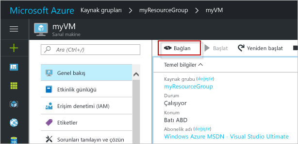

# <a name="create-a-windows-virtual-machine-with-hello-azure-portal"></a>Hello Azure portal ile bir Windows sanal makine oluşturma

Azure sanal makineleri hello Azure portal oluşturulabilir. Bu yöntem, sanal makineleri ve tüm ilgili kaynakları oluşturup yapılandırmaya yönelik tarayıcı tabanlı bir kullanıcı arabirimi sağlar. Bir sanal makine oluşturma ve hello VM üzerinde bir Web sunucusu yükleme ile bu hızlı başlangıç adımları.

Azure aboneliğiniz yoksa başlamadan önce [ücretsiz bir hesap](https://azure.microsoft.com/free/?WT.mc_id=A261C142F) oluşturun.

## <a name="log-in-tooazure"></a>İçinde tooAzure oturum

İçinde toohello http://portal.azure.com Azure portalında oturum açın.

## <a name="create-virtual-machine"></a>Sanal makine oluşturma

1. Merhaba tıklatın **yeni** düğmesi hello sol üst köşesinin hello Azure portalı üzerinde bulunamadı.

2. **İşlem**'i seçin ve sonra da **Windows Server 2016 Datacenter**'ı seçin. 

3. Merhaba sanal makine bilgilerini girin. Merhaba kullanıcı adı ve parola buraya girilen toohello sanal makinede kullanılan toolog olur. İşlem tamamlandığında **Tamam**’a tıklayın.

      

4. Merhaba VM boyutunu seçin. Daha fazla boyutları toosee seçin **tüm görüntüle** veya hello değiştirme **desteklenen disk türü** Filtresi. 

      

5. Hello ayarları dikey penceresinde hello Varsayılanları tutun ve **Tamam**.

6. Merhaba Özet sayfasında, tıklatın **Tamam** toostart hello sanal makine dağıtımı.

7. Merhaba VM sabitlenmiş toohello Azure portalı panosunun olacaktır. Merhaba dağıtım tamamlandıktan sonra otomatik olarak hello VM Özet dikey pencere açılır.


## <a name="connect-toovirtual-machine"></a>Toovirtual makineyi bağlayın

Bir Uzak Masaüstü Bağlantısı toohello sanal makine oluşturun.

1. Merhaba tıklatın **Bağlan** hello sanal makine özellikler düğmesine. Uzak Masaüstü Protokolü dosyasını (.rdp dosyası) oluşturulup indirilir.

     

2. tooconnect tooyour VM, açık hello RDP dosyasını karşıdan. İstenirse, **Bağlan**’a tıklayın. Bunun gibi bir RDP istemcisinin gereken bir Mac üzerinde [Uzak Masaüstü İstemcisi](https://itunes.apple.com/us/app/microsoft-remote-desktop/id715768417?mt=12) hello Mac uygulama Mağazası'ndan.

3. Merhaba kullanıcı adı ve hello sanal makine oluştururken belirttiğiniz parolayı girin ve ardından **Tamam**.

4. Merhaba oturum açma işlemi sırasında bir sertifika uyarı alabilirsiniz. Tıklatın **Evet** veya **devam** hello bağlantıyla tooproceed.


## <a name="install-iis-using-powershell"></a>PowerShell kullanarak IIS yükleme

Merhaba sanal makinede bir PowerShell oturumu başlatın ve komutu tooinstall IIS aşağıdaki hello çalıştırın.

```powershell
Install-WindowsFeature -name Web-Server -IncludeManagementTools
```

İşiniz bittiğinde, hello RDP oturumu çıkmak ve hello VM Özellikleri'hello Azure portal döndürür.

## <a name="open-port-80-for-web-traffic"></a>Web trafiği için 80 numaralı bağlantı noktasını açın 

Ağ güvenlik grubu (NSG), gelen ve giden trafiğin güvenliğini sağlar. Azure portal hello VM oluşturulduğunda, bir gelen kuralı RDP bağlantıları için 3389 numaralı bağlantı noktasında oluşturulur. Bu VM barındıran bir Web sunucusu olduğundan, bir NSG kuralı bağlantı noktası 80 için oluşturulan toobe gerekir.

1. Merhaba hello adına Hello sanal makineye tıklayın **kaynak grubu**.
2. Select hello **ağ güvenlik grubu**. Merhaba NSG hello kullanılarak tanımlanabilir **türü** sütun. 
3. Ayarlar altında hello sol menüsünde tıklatın **gelen güvenlik kuralları**.
4. **Ekle**'ye tıklayın.
5. **Ad** alanına **http** yazın. Emin olun **bağlantı noktası aralığı** too80 ayarlanır ve **eylem** çok ayarlanır**izin**. 
6. **Tamam** düğmesine tıklayın.


## <a name="view-hello-iis-welcome-page"></a>Görünüm hello IIS Karşılama sayfası

IIS ile tooyour VM yüklü ve bağlantı noktası 80'i açın, hello Web sunucusu artık erişilebilir hello Internet. Bir web tarayıcısı açın ve hello VM hello ortak IP adresini girin. Merhaba genel IP adresi hello VM dikey penceresinde hello Azure portalında bulunabilir.

 

## <a name="clean-up-resources"></a>Kaynakları temizleme

Artık gerektiğinde Merhaba kaynak grubu, sanal makine ve tüm ilişkili kaynakları silin. toodo bunu hello sanal makine dikey penceresinden hello kaynak grubu seçin ve tıklatın **silmek**.

## <a name="next-steps"></a>Sonraki adımlar

Bu hızlı başlangıçta basit bir sanal makine ve bir ağ güvenlik grubu kuralı dağıtıp, bir web sunucusu yüklediniz. Azure sanal makinelerde hakkında daha fazla toolearn toohello öğretici Windows VM'ler için devam edin.

> [!div class="nextstepaction"]
> [Azure Windows sanal makine öğreticileri](./tutorial-manage-vm.md)
