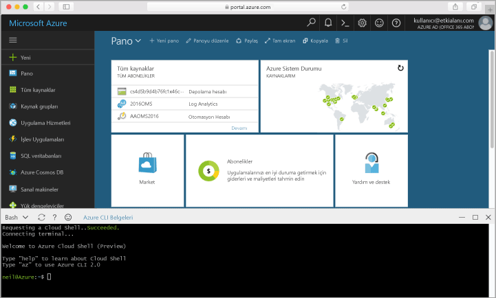

## Azure Cloud Shell'i başlatma

Hello Azure bulut Kabuğu doğrudan hello Azure portal'içinde çalıştırabilirsiniz boş bir Bash kabuğunda ' dir. Azure CLI yüklenmiş ve toouse hesabınız ile yapılandırılan hello sahiptir. Merhaba tıklatın **bulut Kabuk** hello üst sağ hello hello menüsünde düğmesini [Azure portal](https://portal.azure.com).

Merhaba düğmesi hello tüm adımlar bu konuda toorun kullanabileceğiniz etkileşimli bir kabuk başlatır:

