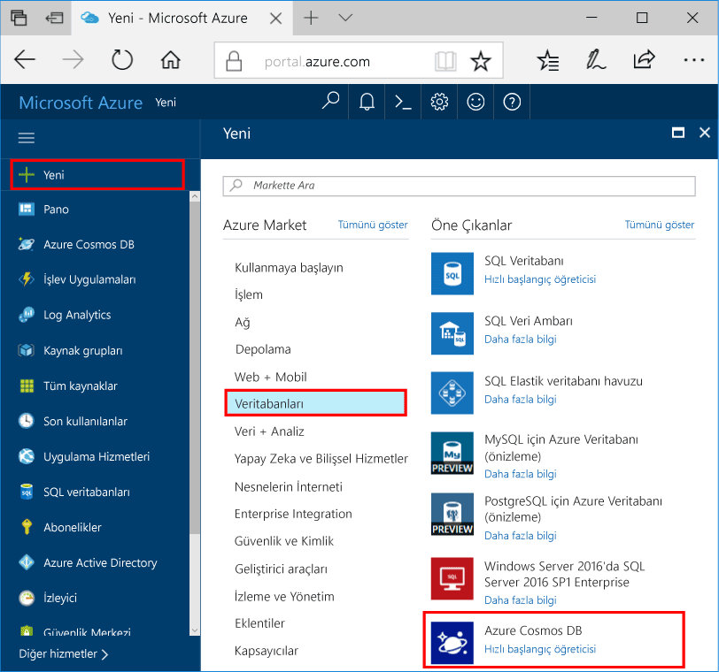
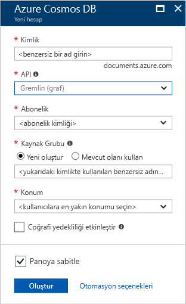

1. Yeni bir pencerede [Azure portalında](https://portal.azure.com/) oturum açın.In a new window, sign in to the [Azure portal](https://portal.azure.com/).
2. Sol taraftaki bölmede **Yeni**'ye, **Veritabanları**'na ve ardından **Azure Cosmos DB**' altında **Oluştur**’a tıklayın.In the left pane, click **New**, click **Databases**, and then under **Azure Cosmos DB**, click **Create**.
   
   

3. **Yeni hesap** dikey penceresinde Azure Cosmos DB hesabınız için istediğiniz yapılandırmayı belirtin.In the **New account** blade, specify the configuration that you want for this Azure Cosmos DB account. 

    Azure Cosmos DB'de her biri farklı bir hesap gerektiren dört programlama modelinden birini seçebilirsiniz: Gremlin (grafik), MongoDB, SQL (DocumentDB) ve Tablo (anahtar-değer).With Azure Cosmos DB, you can choose one of four programming models: Gremlin (graph), MongoDB, SQL (DocumentDB), and Table (key-value), each which currently require a separate account.
       
    Bu hızlı başlangıç makalesinde Grafik API'si ile programlama yapacağımız için formu doldururken **Gremlin (grafik)** seçeneğini belirleyin.In this quick-start article, we program against the Graph API, so choose **Gremlin (graph)** as you fill out the form. Ancak bir katalog uygulamasından belge verileriniz, anahtar/değer (tablo) verileriniz veya bir MongoDB uygulamasından aktarılmış verileriniz varsa Azure Cosmos DB'nin görev açısından kritik tüm uygulamalarınız için yüksek oranda kullanılabilir ve genel olarak dağıtılmış bir veritabanı hizmeti platformu sunacağını unutmayın.If you have document data from a catalog app, key/value (table) data, or data that's migrated from a MongoDB app, realize that Azure Cosmos DB can provide a highly available, globally distributed database service platform for all your mission-critical applications.

    **Yeni hesap** dikey penceresindeki alanları, aşağıdaki ekran görüntüsündeki bilgilerden yararlanarak doldurun. Değerleriniz ekran görüntüsündeki değerlerden farklı olabilir.Complete the fields on the **New account** blade, using the information in the following screenshot as a guide - your values may be different than the values in the screenshot.
 
    

    AyarSetting|Önerilen değerSuggested value|AçıklamaDescription
    ---|---|---
    KimlikID|*Benzersiz değer**Unique value*|Bu Azure Cosmos DB hesabını tanımlayan benzersiz bir ad.A unique name that identifies this Azure Cosmos DB account. Girdiğiniz kimliğe *documents.azure.com* eklenerek URI'niz oluşturulacağından benzersiz ancak tanımlanabilir bir kimlik kullanın.Because *documents.azure.com* is appended to the ID that you provide to create your URI, use a unique but identifiable ID. Kimlik yalnızca küçük harf, sayı ve kısa çizgi (-) karakterini içerebilir ve 3 ila 50 karakterden oluşmalıdır.The ID must contain only lowercase letters, numbers, and the hyphen (-) character, and it must contain from 3 to 50 characters.
    APIAPI|Gremlin (grafik)Gremlin (graph)|Bu makalenin ilerleyen bölümlerinde [Grafik API'si](../articles/cosmos-db/graph-introduction.md) ile programlama yapacağız.We program against the [Graph API](../articles/cosmos-db/graph-introduction.md) later in this article.|
    AbonelikSubscription|*Aboneliğiniz**Your subscription*|Bu Azure Cosmos DB hesabı için kullanmak istediğiniz Azure aboneliği.The Azure subscription that you want to use for this Azure Cosmos DB account. 
    Kaynak GrubuResource Group|*Kimlikle aynı değer**The same value as ID*|Hesabınız için yeni kaynak grubu adı.The new resource group name for your account. Kolaylık olması için kimliğinizle aynı adı kullanabilirsiniz.For simplicity, you can use the same name as your ID. 
    KonumLocation|*Kullanıcılarınıza en yakın bölge**The region closest to your users*|Azure Cosmos DB hesabınızın barındırılacağı coğrafi konum.The geographic location in which to host your Azure Cosmos DB account. Verilere en hızlı erişim için kullanıcılarınıza en yakın konumu seçin.Choose the location closest to your users to give them the fastest access to the data.

4. Hesabı oluşturmak için **Oluştur**’a tıklayın.Click **Create** to create the account.
5. Dağıtım sürecini izlemek için üst araç çubuğunda **Bildirimler** simgesine  tıklatın.On the top toolbar, click the **Notifications** icon  to monitor the deployment process.

    

6.  Bildirimler penceresinde dağıtımın başarılı olduğu gösterildiğinde, bildirim penceresini kapatın ve Panodaki **Tüm Kaynaklar** kutucuğundan yeni hesabı açın.When the Notifications window indicates the deployment succeeded, close the notification window and open the new account from the **All Resources** tile on the Dashboard. 

    