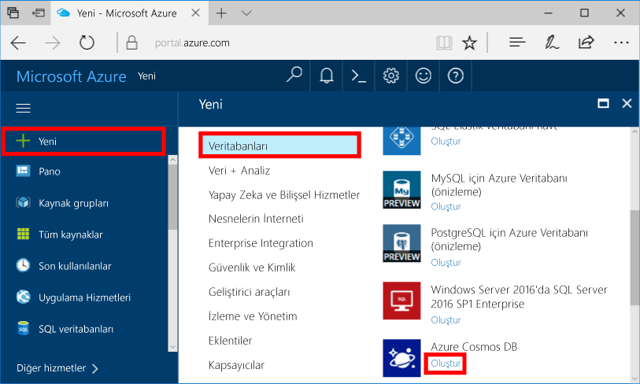
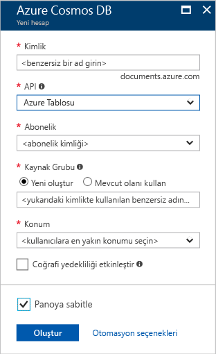
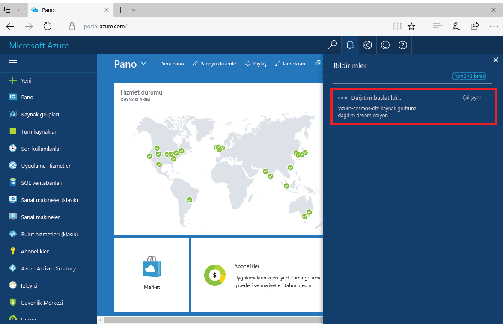
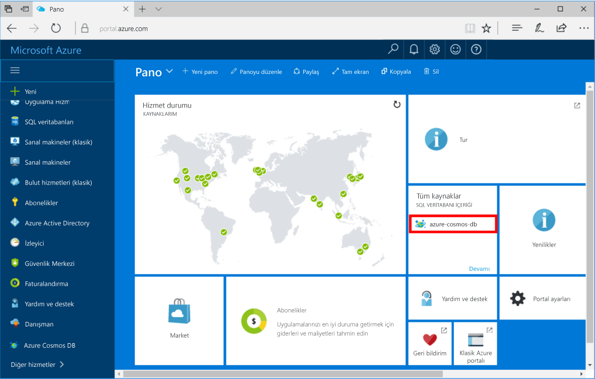

1. Yeni bir pencerede toohello içinde oturum [Azure portal](https://portal.azure.com/).In a new window, sign in toohello [Azure portal](https://portal.azure.com/).
2. Hello sol menüde'ı tıklatın **yeni**, tıklatın **veritabanları**ve ardından **Azure Cosmos DB**, tıklatın **oluşturma**.In hello left menu, click **New**, click **Databases**, and then under **Azure Cosmos DB**, click **Create**.
   
   

3. Merhaba, **yeni hesabı** dikey penceresinde hello hello Azure Cosmos DB hesabı için istenen yapılandırmayı belirtin.In hello **New account** blade, specify hello desired configuration for hello Azure Cosmos DB account. 

    Azure Cosmos DB'de dört programlama modelinden birini seçebilirsiniz: Gremlin (grafik), MongoDB, SQL (DocumentDB) ve Tablo (anahtar-değer).With Azure Cosmos DB, you can choose one of four programming models: Gremlin (graph), MongoDB, SQL (DocumentDB), and Table (key-value). 
       
    Seçtiğiniz böylece bu hızlı başlangıç biz MongoDB API hello karşı programlama **MongoDB** gibi hello formu doldurun.In this quick start we'll be programming against hello MongoDB API so you'll choose **MongoDB** as you fill out hello form. Ancak bir sosyal medya uygulaması için grafik verileriniz, bir katalog uygulamasından belge verileriniz veya anahtar/değer (tablo) verileriniz varsa Azure Cosmos DB'nin tüm görev açısından kritik uygulamalarınız için yüksek oranda kullanılabilir ve genel olarak dağıtılmış bir veritabanı hizmeti platformu sunacağını unutmayın.But if you have graph data for a social media app, document data from a catalog app, or key/value (table) data, realize that Azure Cosmos DB can provide a highly available, globally-distributed database service platform for all your mission-critical applications.

    Merhaba dolgu **yeni hesabı** dikey penceresinde hello bilgileri hello tabloda kılavuz olarak kullanarak.Fill out hello **New account** blade using hello information in hello table as a guide.
 
    
   
    AyarSetting|Önerilen değerSuggested value|AçıklamaDescription
    ---|---|---
    KimlikID|*Benzersiz değer**Unique value*|Benzersiz bir ad tooidentify hello Azure Cosmos DB hesabı seçin.A unique name you choose tooidentify hello Azure Cosmos DB account. *Documents.Azure.com* eklenmiş toohello kimliği, URI toocreate sağlar, bu nedenle bir benzersiz ancak tanımlanabilen kimliği kullanın*documents.azure.com* is appended toohello ID you provide toocreate your URI, so use a unique but identifiable ID. Merhaba kimliği yalnızca küçük harf, sayı ve hello içerebilir '-' karakteri ve 3-50 karakter arasında olmalıdır.hello ID may contain only lowercase letters, numbers, and hello '-' character, and must be between 3 and 50 characters.
    APIAPI|MongoDBMongoDB|Biz hello karşı programlama [MongoDB API](../articles/documentdb/documentdb-protocol-mongodb.md) bu makalenin ilerisinde yer.We'll be programming against hello [MongoDB API](../articles/documentdb/documentdb-protocol-mongodb.md) later in this article.|
    AbonelikSubscription|*Aboneliğiniz**Your subscription*|toouse hello Azure Cosmos DB hesap için istediğiniz Azure aboneliği hello.hello Azure subscription that you want toouse for hello Azure Cosmos DB account. 
    Kaynak GrubuResource Group|*aynı kimliği olarak değeri hello**hello same value as ID*|Merhaba yeni kaynak grubu adı, hesabınız için.hello new resource group name for your account. Kolaylık olması için kimliğinizi hello aynı adı kullanabilirsinizFor simplicity, you can use hello same name as your ID. 
    KonumLocation|*Merhaba bölgeye en yakın tooyour kullanıcılar**hello region closest tooyour users*|hangi toohost coğrafi konumda Azure Cosmos DB hesabınızı hello.hello geographic location in which toohost your Azure Cosmos DB account. En yakın tooyour kullanıcılar Hello konumu seçin bunları hello hızlı erişim toohello veri toogive.Choose hello location closest tooyour users toogive them hello fastest access toohello data.

4. Tıklatın **oluşturma** toocreate hello hesabı.Click **Create** toocreate hello account.
5. Merhaba araç çubuğundan, **bildirimleri** toomonitor hello dağıtım işlemi.On hello toolbar, click **Notifications** toomonitor hello deployment process.

    

6.  Hello dağıtım tamamlandıktan sonra yeni hesabınıza hello açık hello tüm kaynakları döşeme.When hello deployment is complete, open hello new account from hello All Resources tile. 

    
