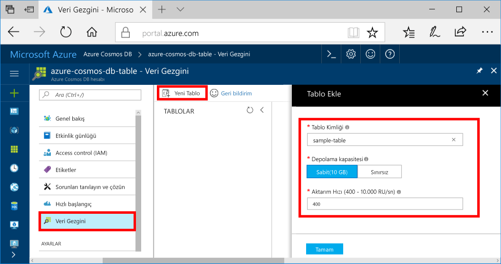

Şimdi Veri Gezgini toocreate bir tablo kullanın ve veri tooyour veritabanı ekleyin. 

1. Merhaba hello Gezinti menüsünde, Azure portal'ı tıklatın **Veri Gezgini (Önizleme)**. 
2. Merhaba Veri Gezgini dikey penceresinde tıklayın **yeni tablo**, aşağıdaki bilgilerle hello kullanarak hello sayfasında doldurun.

    

    Ayar|Önerilen değer|Açıklama
    ---|---|---
    Tablo kimliği|sample-table|Yeni tablonuzun Hello kimliği. Tablo adları hello sahip veritabanı kimlikleri aynı karakter gereksinimleri. Veritabanı adı 1 ile 255 karakter arasında olmalı, `/ \ # ?` içermemeli ve boşlukla bitmemelidir.
    Depolama kapasitesi| 10 GB|Merhaba varsayılan değeri bırakın. Merhaba depolama kapasitesi hello veritabanının budur.
    Aktarım hızı|400 RU|Merhaba varsayılan değeri bırakın. Merhaba ölçeklendirebilirsiniz [işleme](../articles/cosmos-db/request-units.md) tooreduce gecikme isterseniz daha sonra.

3. Merhaba form doldurulur sonra tıklayın **Tamam**.
