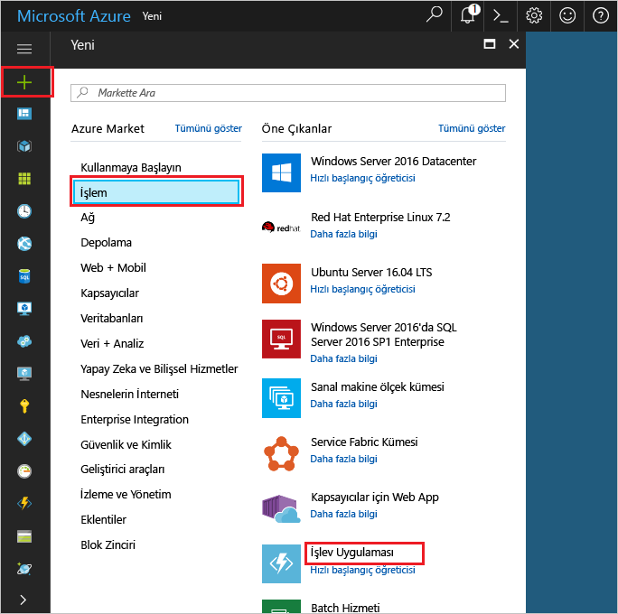

1. Merhaba tıklatın **yeni** düğmesi hello sol üst köşesinin hello Azure portalı üzerinde bulunamadı.Click hello **New** button found on hello upper left-hand corner of hello Azure portal.

1. **İşlem** > **İşlev Uygulaması**'na tıklayın ve **Aboneliğinizi** seçin.Click **Compute** > **Function App**, select your **Subscription**. Ardından, hello tabloda belirtildiği gibi hello işlevi uygulama ayarlarını kullanın.Then, use hello function app settings as specified in hello table.

    

    | AyarSetting      | Önerilen değerSuggested value  | AçıklamaDescription                                        |
    | ------------ |  ------- | -------------------------------------------------- |
    | **Uygulama adı****App name** | Genel olarak benzersiz bir adGlobally unique name | Yeni işlev uygulamanızı tanımlayan ad.Name that identifies your new function app. | 
    | **[Kaynak Grubu](../articles/azure-resource-manager/resource-group-overview.md)****[Resource Group](../articles/azure-resource-manager/resource-group-overview.md)** |  myResourceGroupmyResourceGroup | Merhaba yeni kaynak grubunda hangi toocreate için işlevi uygulamanızı adlandırın.Name for hello new resource group in which toocreate your function app. | 
    | **[Barındırma planı](../articles/azure-functions/functions-scale.md)****[Hosting plan](../articles/azure-functions/functions-scale.md)** |   Tüketim planıConsumption plan | Tooyour işlev uygulaması kaynaklarının nasıl ayrıldığını tanımlar barındırma planı.Hosting plan that defines how resources are allocated tooyour function app. Merhaba varsayılan **tüketim planlama**, kaynakları işlevlerinizi gerektirdiği gibi dinamik olarak eklenir.In hello default **Consumption Plan**, resources are added dynamically as required by your functions. Yalnızca işlevlerinizi hello çalıştırdığınızda için ödeme yaparsınız.You only pay for hello time your functions run.   |
    | **Konum****Location** | Batı AvrupaWest Europe | Kendinize veya işlevinizin erişeceği diğer hizmetlere yakın bir konum seçin.Choose a location near you or near other services your functions will access. |
    | **[Depolama hesabı](../articles/storage/common/storage-create-storage-account.md#create-a-storage-account)****[Storage account](../articles/storage/common/storage-create-storage-account.md#create-a-storage-account)** |  Genel olarak benzersiz bir adGlobally unique name |  Merhaba işlevi uygulamanız tarafından kullanılan yeni depolama hesabı adı.Name of hello new storage account used by your function app. Depolama hesabı adları 3 ile 24 karakter arasında olmalı ve yalnızca sayıyla küçük harf içermelidir.Storage account names must be between 3 and 24 characters in length and may contain numbers and lowercase letters only. Var olan bir hesabı da kullanabilirsiniz.You can also use an existing account. |

1. Tıklatın **oluşturma** tooprovision ve hello yeni işlev uygulaması dağıtın.Click **Create** tooprovision and deploy hello new function app.
