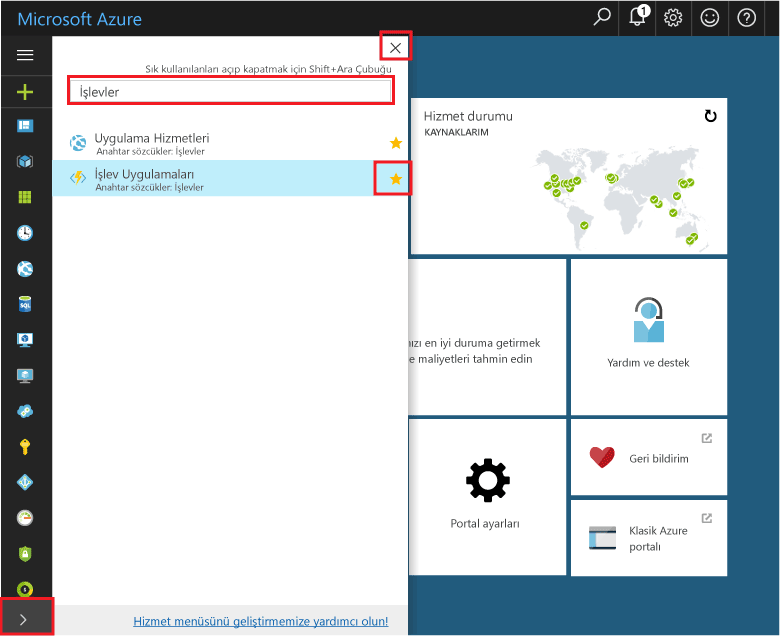
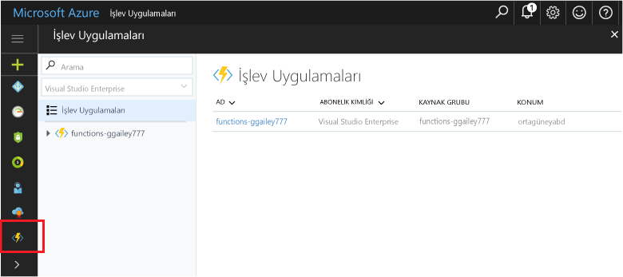

## İşlev Uygulamalarını portaldaki sık kullanılanlar listesine eklemeAdd Function Apps to your portal favorites 

Şimdiye kadar yapmadıysanız İşlev Uygulamalarını Azure portalındaki sık kullanılanlar listenize ekleyin.If you haven't already done so, add Function Apps to your favorites in the Azure portal. Bu sayede işlev uygulamalarınızı daha kolay bulabilirsiniz.This makes it easier to find your function apps. Bunu önceden yaptıysanız sonraki bölüme geçin.If you have already done this, skip to the next section. 

1. [Azure Portal](https://portal.azure.com/)’da oturum açın.Log in to the [Azure portal](https://portal.azure.com/).

2. Sol altta bulunan oka tıklayarak tüm hizmetleri genişletin, **Filtre** alanına `Functions` yazın ve **İşlev Uygulamaları**'nın yanındaki yıldıza tıklayın.Click the arrow at the bottom left to expand all services, type `Functions` in the **Filter** field, and then click the star next to **Function Apps**.  
 
    

    Bunu yaptığınızda portalın sol tarafındaki menüye İşlevler simgesi eklenir.This adds the Functions icon to the menu on the left of the portal.

3. Menüyü kapatın ve İşlevler simgesini görmek için sayfayı aşağı kaydırın.Close the menu, then scroll down to the bottom to see the Functions icon. Tüm işlev uygulamalarınızın bir listesini görmek için bu simgeye tıklayın.Click this icon to see a list of all your function apps. Bu uygulamadaki işlevlerle çalışmak için işlev uygulamanıza tıklayın.Click your function app to work with functions in this app. 
 
    
 
     