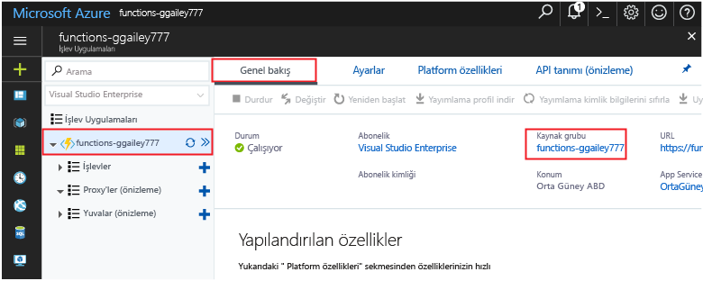

Bu koleksiyondaki diğer hızlı başlangıçlar, bu hızlı başlangıca göre belirlenir.Other quick starts in this collection build upon this quick start. Sonraki hızlı başlangıçlar veya hello öğreticileri toowork üzerinde toocontinue planlıyorsanız, temiz oluşturulan bu hızlı başlangıç kaynakları başlatılmaz.If you plan toocontinue on toowork with subsequent quick starts or with hello tutorials, do not clean up hello resources created in this quick start. 

Toocontinue düşünmüyorsanız hello tıklatın **kaynak grubu** hello portal ve ardından hello işlev uygulaması için **silmek**.If you do not plan toocontinue, click hello **Resource group** for hello function app in hello portal, and then click **Delete**. 

