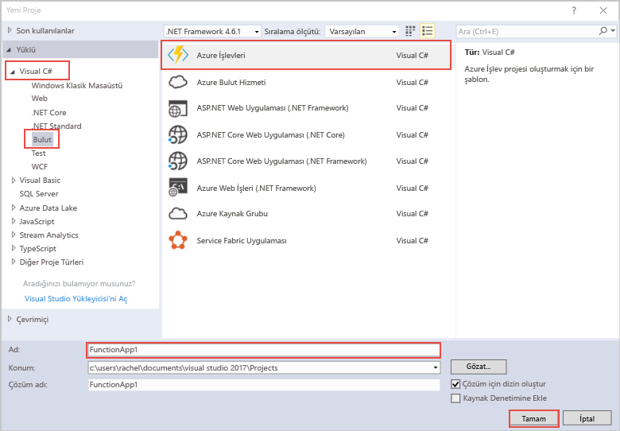

Visual Studio'da Hello Azure işlevleri proje şablonu yayımlanan tooa işlev uygulaması Azure olabilir bir proje oluşturur. İşlev uygulaması, kaynakların daha kolay yönetilmesi, dağıtılması ve paylaşılması için işlevleri bir mantıksal birim olarak gruplandırmanıza olanak tanır.   

1. ' Nde hello proje düğümüne farenin sağ düğmesiyle tıklayın **Çözüm Gezgini**, ardından **Ekle** > **yeni öğe**. Seçin **Azure işlevi** hello iletişim kutusundan.

2. Merhaba, **yeni proje** iletişim kutusunda, genişletin **Visual C#** > **bulut** düğümü, select **Azure işlevleri**, bir yazın**Adı** proje ve tıklatın **Tamam**. Merhaba işlevi uygulama adı alt çizgi, kısa çizgi veya herhangi bir alfasayısal olmayan karakterler kullanmayın için C# ad alanı olarak, geçerli olmalıdır. 

    
