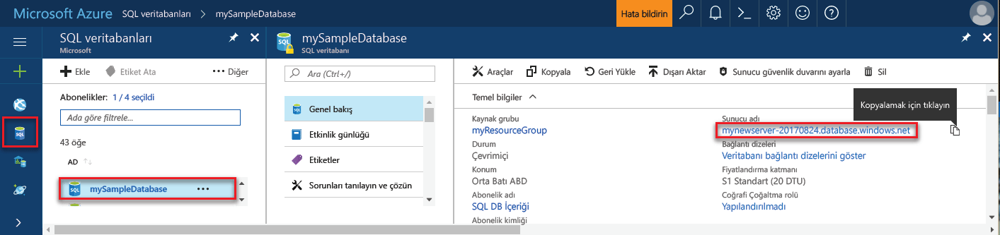

## Toohello Azure portalında oturum açınLog in toohello Azure portal

İçinde toohello oturum [Azure portal](https://portal.azure.com/).Log in toohello [Azure portal](https://portal.azure.com/).

## Hello Azure portalını kullanarak boş bir SQL veritabanı oluşturmaCreate a blank SQL database using hello Azure portal

Azure SQL veritabanı bir dizi [işlem ve depolama kaynağı](../articles/sql-database/sql-database-service-tiers.md) ile oluşturulur.An Azure SQL database is created with a defined set of [compute and storage resources](../articles/sql-database/sql-database-service-tiers.md). Merhaba veritabanı içinde oluşturulur bir [Azure kaynak grubu](../articles/azure-resource-manager/resource-group-overview.md) ve bir [Azure SQL Database mantıksal sunucusu](../articles/sql-database/sql-database-features.md).hello database is created within an [Azure resource group](../articles/azure-resource-manager/resource-group-overview.md) and in an [Azure SQL Database logical server](../articles/sql-database/sql-database-features.md). 

Bu adımları toocreate boş bir SQL veritabanı izleyin.Follow these steps toocreate a blank SQL database. 

1. Merhaba tıklatın **yeni** düğmesi hello sol üst köşesinin hello Azure portalı üzerinde bulunamadı.Click hello **New** button found on hello upper left-hand corner of hello Azure portal.

2. Seçin **veritabanları** hello gelen **yeni** sayfasında ve seçin **SQL veritabanı** hello gelen **veritabanları** sayfası.Select **Databases** from hello **New** page, and select **SQL Database** from hello **Databases** page. 

   

3. Hello SQL veritabanı formu görüntü önceki hello üzerinde gösterildiği gibi bilgileri, aşağıdaki hello ile doldurun:Fill out hello SQL Database form with hello following information, as shown on hello preceding image:   

   | AyarSetting | Önerilen değerSuggested value | AçıklamaDescription |
   | --------| --------------- | ----------- | 
   | **Veritabanı adı****Database name** | mySampleDatabasemySampleDatabase | Geçerli veritabanı adları için bkz. [Veritabanı Tanımlayıcıları](https://docs.microsoft.com/sql/relational-databases/databases/database-identifiers).For valid database names, see [Database Identifiers](https://docs.microsoft.com/sql/relational-databases/databases/database-identifiers). | 
   | **Abonelik****Subscription** | AboneliğinizYour subscription  | Abonelikleriniz hakkında daha ayrıntılı bilgi için bkz. [Abonelikler](https://account.windowsazure.com/Subscriptions).For details about your subscriptions, see [Subscriptions](https://account.windowsazure.com/Subscriptions). |
   | **Kaynak grubu****Resource group** | myResourceGroupmyResourceGroup | Geçerli kaynak grubu adları için bkz. [Adlandırma kuralları ve kısıtlamalar](https://docs.microsoft.com/azure/architecture/best-practices/naming-conventions).For valid resource group names, see [Naming rules and restrictions](https://docs.microsoft.com/azure/architecture/best-practices/naming-conventions). |
   | **Kaynak seçin****Select source** | Boş veritabanıBlank database | Boş bir veritabanı oluşturulması gerektiğini belirtir.Specifies that a blank database should be created. |
   ||||

4. Tıklatın **Server** toocreate ve yeni veritabanı için yeni bir sunucu yapılandırabilirsiniz.Click **Server** toocreate and configure a new server for your new database. Merhaba dolgu **yeni sunucu form** bilgisinden hello ile:Fill out hello **New server form** with hello following information: 

   | AyarSetting | Önerilen değerSuggested value | AçıklamaDescription |
   | --------| --------------- | ----------- | 
   | **Sunucu adı****Server name** | Herhangi bir genel benzersiz adı.Any globally unique name. | Geçerli sunucu adları için bkz. [Adlandırma kuralları ve kısıtlamalar](https://docs.microsoft.com/azure/architecture/best-practices/naming-conventions).For valid server names, see [Naming rules and restrictions](https://docs.microsoft.com/azure/architecture/best-practices/naming-conventions). | 
   | **Sunucu yöneticisi oturum açma bilgileri****Server admin login** | Herhangi bir geçerli adı.Any valid name. | Geçerli oturum açma adları için bkz. [Veritabanı Tanımlayıcıları](https://docs.microsoft.com/sql/relational-databases/databases/database-identifiers).For valid login names, see [Database Identifiers](https://docs.microsoft.com/sql/relational-databases/databases/database-identifiers).|
   | **Parola****Password** | Geçerli parola.Any valid password. | Parolanız en az sekiz karakter olmalıdır ve kategorileri aşağıdaki hello üçünden karakterler içermelidir: büyük harf karakterler, küçük harfler, sayılar ve alfasayısal olmayan karakter.Your password must have at least eight characters and must contain characters from three of hello following categories: upper case characters, lower case characters, numbers, and non-alphanumeric characters. |
   | **Konum****Location** | Herhangi bir geçerli konumu.Any valid location. | Bölgeler hakkında bilgi için bkz. [Azure Bölgeleri](https://azure.microsoft.com/regions/).For information about regions, see [Azure Regions](https://azure.microsoft.com/regions/). |
   ||||

   

5. **Seç**'e tıklayın.Click **Select**.

6. Tıklatın **fiyatlandırma katmanı** toospecify hello hizmeti katmanını ve performans düzeyini yeni veritabanı.Click **Pricing tier** toospecify hello service tier and performance level for your new database. Bu öğretici için seçin **20 Dtu'lar** ve **250** GB depolama alanı.For this tutorial, select **20 DTUs** and **250** GB of storage.

   

7. **Uygula**'ya tıklayın.Click **Apply**.  

8. Seçin bir **harmanlama** hello boş veritabanı (Bu öğretici için kullanım hello varsayılan değer).Select a **collation** for hello blank database (for this tutorial, use hello default value). Harmanlamaları hakkında daha fazla bilgi için bkz: [harmanlamaları](https://docs.microsoft.com/sql/t-sql/statements/collations)For more information about collations, see [Collations](https://docs.microsoft.com/sql/t-sql/statements/collations)

9. Tıklatın **oluşturma** tooprovision hello veritabanı.Click **Create** tooprovision hello database. Bir dakika ve bir yarı toocomplete hakkında alır sağlama.Provisioning takes about a minute and a half toocomplete. 

10. Merhaba araç çubuğundan, **bildirimleri** toomonitor hello dağıtım işlemi.On hello toolbar, click **Notifications** toomonitor hello deployment process.

   

## Hello Azure portal kullanarak bir sunucu düzeyinde güvenlik duvarı kuralı oluşturmaCreate a server-level firewall rule using hello Azure portal

SQL veritabanı hizmetinin Hello hello sunucu düzeyinde güvenlik duvarı oluşturur.hello SQL Database service creates a firewall at hello server-level. Başlangıçta hello güvenlik duvarı dış araçları ve uygulamaları toohello sunucu ya da hello sunucudaki tooany veritabanları bağlanmasını engeller.Initially hello firewall prevents external tools and applications from connecting toohello server, or tooany databases on hello server. Bir güvenlik duvarı kuralı tooopen belirli IP adreslerini oluşturulduktan sonra bağlantılara izin verilir.Connections are allowed after a firewall rule is created tooopen specific IP addresses. Bu adımları toocreate izleyin bir [SQL veritabanı sunucu düzeyinde güvenlik duvarı kuralı](../articles/sql-database/sql-database-firewall-configure.md) , istemcinin IP adresi ve IP adresiniz yalnızca hello SQL veritabanı güvenlik duvarı üzerinden tooenable dış bağlantısı.Follow these steps toocreate a [SQL Database server-level firewall rule](../articles/sql-database/sql-database-firewall-configure.md) for your client's IP address, and tooenable external connectivity through hello SQL Database firewall for your IP address only. 

> [!NOTE]
> Azure SQL veritabanı bağlantı noktası 1433 üzerinden iletişim kurar.Azure SQL Database communicates over port 1433. Yalnızca hello güvenlik duvarı ağınızın 1433 bağlantı noktası üzerinden giden trafik verir sonra tooSQL veritabanı bağlanabilirsiniz.You can connect tooSQL Database only after hello firewall of your network allows outbound traffic through port 1433.

1. Merhaba dağıtım tamamlandıktan sonra **SQL veritabanları** hello sol menüsünden ve ardından **mySampleDatabase** hello üzerinde **SQL veritabanları** sayfası.After hello deployment completes, click **SQL databases** from hello left-hand menu and then click **mySampleDatabase** on hello **SQL databases** page. Merhaba hello tam olarak gösteren, veritabanı açılır genel bakış sayfasında tam sunucu adını (gibi **mynewserver20170313.database.windows.net**) ve diğer yapılandırmalar için seçenekler sağlar.hello overview page for your database opens, showing you hello fully qualified server name (such as **mynewserver20170313.database.windows.net**) and provides options for further configuration. Daha sonra kullanmak üzere bu tam sunucu adını kopyalayın.Copy this fully qualified server name for use later.

   > [!IMPORTANT]
   > Sonraki hızlı başlatır, veritabanlarını ve bu tam sunucu adı tooconnect tooyour sunucu gerekir.You need this fully qualified server name tooconnect tooyour server and its databases in subsequent quick starts.
   > 

    

2. Tıklatın **ayarlayın sunucu Güvenlik Duvarı** hello önceki görüntüde gösterildiği gibi hello araç.Click **Set server firewall** on hello toolbar as shown in hello previous image. Merhaba **Güvenlik Duvarı ayarları** hello SQL veritabanı sunucusu sayfasını açar.hello **Firewall settings** page for hello SQL Database server opens. 

    

3. Tıklatın **istemci IP'si Ekle** hello araç tooadd üzerinde geçerli IP adresi tooa yeni güvenlik duvarı kuralı.Click **Add client IP** on hello toolbar tooadd your current IP address tooa new firewall rule. Güvenlik duvarı kuralı, 1433 numaralı bağlantı noktasını tek bir IP adresi veya bir IP adresi aralığı için açabilir.A firewall rule can open port 1433 for a single IP address or a range of IP addresses.

4. **Kaydet** düğmesine tıklayın.Click **Save**. Geçerli IP adresiniz hello mantıksal sunucuda bağlantı noktası 1433'ü açmak için bir sunucu düzeyinde güvenlik duvarı kuralı oluşturulur.A server-level firewall rule is created for your current IP address opening port 1433 on hello logical server.

    

4. Tıklatın **Tamam** ve hello kapatın **Güvenlik Duvarı ayarları** sayfası.Click **OK** and then close hello **Firewall settings** page.

Şimdi toohello Azure SQL veritabanı sunucusunu ve veritabanlarını SQL Server Management Studio (SSMS) gibi bir araç kullanarak bağlanabilir.You can now connect toohello Azure SQL Database server and its databases by using a tool such as SQL Server Management Studio (SSMS). Bu IP adresinden Hello bağlantıdır ve daha önce oluşturduğunuz hello server yönetici hesabı kullanır.hello connection is from this IP address, and it uses hello server admin account created previously.

> [!IMPORTANT]
> Varsayılan olarak, tüm Azure hizmetlerini hello SQL veritabanı güvenlik duvarı üzerinden erişim etkin.By default, access through hello SQL Database firewall is enabled for all Azure services. Tıklatın **OFF** tüm Azure Hizmetleri için bu sayfayı toodisable üzerinde.Click **OFF** on this page toodisable for all Azure services.

## Hello Azure portal kullanarak bağlantı dizesi değerlerini almaGet connection string values using hello Azure portal

Azure SQL veritabanı sunucunuz için Hello tam sunucu adını hello Azure portal alın.Get hello fully qualified server name for your Azure SQL Database server in hello Azure portal. SQL Server Management Studio'yu kullanarak hello tam adı tooconnect tooyour sunucusu kullanın.You use hello fully qualified server name tooconnect tooyour server using SQL Server Management Studio.

1. İçinde toohello oturum [Azure portal](https://portal.azure.com/).Log in toohello [Azure portal](https://portal.azure.com/).

2. Seçin **SQL veritabanları** hello sol taraftaki menüden veritabanınızda hello tıklatıp **SQL veritabanları** sayfası.Select **SQL Databases** from hello left-hand menu, and click your database on hello **SQL databases** page. 

3. Merhaba, **Essentials** Merhaba, veritabanı için Azure portal sayfası bölmesinde bulun ve ardından hello kopyalayın **sunucu adı**.In hello **Essentials** pane in hello Azure portal page for your database, locate and then copy hello **Server name**.

    
